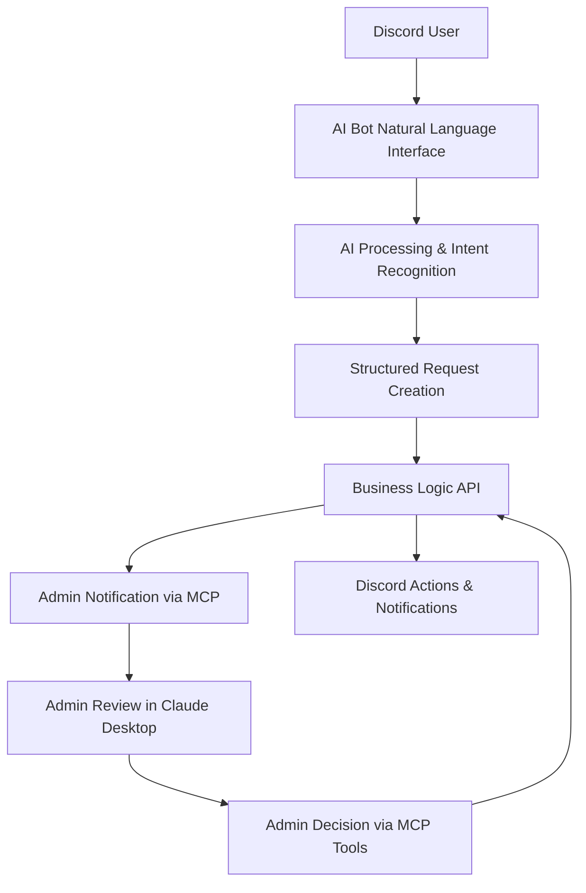

# AI-Powered Discord Bot Implementation Plan
**Package: `virion-labs-discord-bot-ai`**

**Date:** 2025-07-27  
**Status:** Implementation Plan  
**Author:** Claude Code  

## Executive Summary

This document outlines the implementation strategy for transitioning from the current command-based `virion-labs-discord-bot` to an AI-powered `virion-labs-discord-bot-ai` that leverages natural language processing for campaign management and onboarding. The new bot will serve as an intelligent intermediary between Discord users and platform administrators, using AI to understand and process requests while maintaining the robust workflow management capabilities of the existing system.

## Current State Analysis

### Existing Discord Bot Architecture
The current `virion-labs-discord-bot` provides:
- **Command-Based Interface**: `/join` and `/request-access` slash commands
- **Interactive Onboarding**: Modal-based questionnaire system with dynamic field generation
- **Campaign Discovery**: Intelligent filtering based on channel context and user roles
- **Referral Tracking**: Sophisticated invite attribution system
- **Role Management**: Automatic Discord role assignment upon completion
- **Dashboard Integration**: Real-time synchronization via webhooks and API endpoints

### Key Features to Preserve
1. **Campaign Discovery & Filtering**
2. **User Onboarding & Data Collection**
3. **Referral Attribution & Analytics**
4. **Role-Based Access Control**
5. **Admin Campaign Management**
6. **Real-time Dashboard Synchronization**

## AI-Powered Bot Vision

### Core Philosophy
The new AI bot will **not** be a traditional chatbot that responds automatically. Instead, it will:
- Use AI to **understand and parse** natural language requests
- **Process and structure** user intentions into actionable data
- **Facilitate admin management** through MCP server integration
- **Handle the heavy lifting** of campaign management workflows

### Admin-Centric Workflow


## Feature Translation Matrix

### 1. Campaign Discovery
**Current**: `/join` command with campaign list selection
**AI-Powered**: Natural language campaign exploration

```
User: "What campaigns are available for fitness influencers?"
AI Bot: "I found 3 active fitness campaigns you might be interested in:
        1. Summer Fitness Challenge - $500 payout
        2. Healthy Living Brand - $300 + products  
        3. Workout Gear Review - $200 + gear
        
        Would you like to learn more about any of these or start the application process?"
```

### 2. Campaign Application & Onboarding
**Current**: Modal forms with predefined fields
**AI-Powered**: Conversational data collection

```
User: "I want to apply for the Summer Fitness Challenge"
AI Bot: "Great choice! I'll help you apply. Let me gather some information.
        
        First, what's your email address?"
User: "My email is john.doe@gmail.com"
AI Bot: "Perfect! Now, can you tell me about your fitness background and audience?"
User: "I'm a certified personal trainer with 50k followers on Instagram focused on strength training"
AI Bot: "Excellent! How many years have you been in the fitness industry?"
```

### 3. Access Requests
**Current**: `/request-access` command for private channels
**AI-Powered**: Natural language access requests

```
User: "I'd like access to the VIP campaigns channel"
AI Bot: "I understand you're interested in VIP campaign access. Let me help you request that.
        
        Can you tell me why you're interested in VIP campaigns and what makes you a good fit?"
User: "I have 100k followers and have worked with major brands like Nike and Adidas"
AI Bot: "That's impressive! I've submitted your VIP access request to the admin team. 
        They'll review your profile and get back to you within 24 hours."
```

### 4. Admin Campaign Management (via MCP)
**Current**: Dashboard-based management
**AI-Powered**: Natural language admin tools through Claude Desktop

```
Admin in Claude Desktop: "Show me pending campaign applications"
MCP Tool Response: "Found 12 pending applications:
                   1. John Doe - Summer Fitness Challenge (fitness trainer, 50k followers)
                   2. Sarah Smith - Healthy Living Brand (nutritionist, 25k followers)
                   ..."

Admin: "Approve John Doe for the Summer Fitness Challenge and assign him the Influencer role"
MCP Tool: "✅ Approved John Doe for Summer Fitness Challenge
          ✅ Assigned Influencer role in Discord
          ✅ Sent confirmation DM to user"
```

## Technical Architecture

### AI Bot Components

#### 1. Natural Language Understanding (NLU) Layer
```typescript
interface IntentRecognition {
  intent: 'campaign_discovery' | 'application' | 'access_request' | 'general_inquiry';
  confidence: number;
  entities: {
    campaign_type?: string;
    experience_level?: string;
    contact_info?: string;
  };
}
```

#### 2. Conversation State Management
```typescript
interface ConversationState {
  user_id: string;
  current_flow: 'onboarding' | 'access_request' | 'discovery';
  collected_data: Record<string, any>;
  next_expected_input: string;
  context: {
    campaign_id?: string;
    channel_context: string;
  };
}
```

#### 3. Response Generation Engine
```typescript
interface ResponseGenerator {
  generateResponse(intent: IntentRecognition, state: ConversationState): Promise<BotResponse>;
  createFollowUpQuestion(field: OnboardingField, context: any): string;
  formatCampaignList(campaigns: Campaign[], user_context: any): string;
}
```

### Business Logic API Extensions

#### New Endpoints for AI Bot

```typescript
// AI-specific endpoints
POST /api/v1/operations/ai-bot/parse-intent
POST /api/v1/operations/ai-bot/process-conversation
GET  /api/v1/operations/ai-bot/get-conversation-state/{user_id}
PUT  /api/v1/operations/ai-bot/update-conversation-state/{user_id}

// Enhanced onboarding workflow
POST /api/v1/workflows/ai-onboarding/start-conversation
POST /api/v1/workflows/ai-onboarding/process-message
POST /api/v1/workflows/ai-onboarding/complete-application

// Admin review system
GET  /api/v1/operations/admin/pending-ai-applications
POST /api/v1/workflows/admin/process-ai-application
```

### MCP Server Integration

#### New MCP Tools for AI Bot Management

```typescript
// Campaign Application Management
list_pending_ai_applications(): Promise<PendingApplication[]>
get_ai_application_details(application_id: string): Promise<ApplicationDetails>
approve_ai_application(application_id: string, role: string, notes?: string): Promise<void>
reject_ai_application(application_id: string, reason: string): Promise<void>

// Conversation Monitoring
get_active_conversations(): Promise<ActiveConversation[]>
get_conversation_transcript(user_id: string): Promise<ConversationMessage[]>
intervene_in_conversation(user_id: string, admin_message: string): Promise<void>

// Campaign Management
update_campaign_ai_prompts(campaign_id: string, prompts: CampaignPrompts): Promise<void>
get_campaign_ai_analytics(campaign_id: string): Promise<AIAnalytics>
```

## Implementation Phases

### Phase 1: Foundation & AI Infrastructure (Weeks 1-2)
**Deliverables:**
- AI intent recognition system setup
- Conversation state management implementation
- Basic natural language processing pipeline
- Response generation templates

**Technical Tasks:**
```typescript
// Core AI services
class IntentRecognitionService {
  async parseUserMessage(message: string, context: ConversationContext): Promise<IntentRecognition>
  async extractEntities(message: string, expected_type: string): Promise<any>
}

class ConversationManager {
  async initializeConversation(user_id: string, initial_intent: string): Promise<ConversationState>
  async updateConversationState(user_id: string, new_data: any): Promise<ConversationState>
  async getNextQuestion(state: ConversationState): Promise<string>
}
```

### Phase 2: Core Conversation Flows (Weeks 3-4)
**Deliverables:**
- Campaign discovery conversation flow
- Application/onboarding conversation flow
- Access request conversation flow
- Basic error handling and fallbacks

**Technical Tasks:**
```typescript
// Conversation flow handlers
class CampaignDiscoveryFlow {
  async handleDiscoveryIntent(user_id: string, message: string): Promise<BotResponse>
  async filterCampaignsByUserInput(filters: any): Promise<Campaign[]>
  async generateCampaignRecommendations(user_profile: any): Promise<string>
}

class OnboardingFlow {
  async startApplicationProcess(user_id: string, campaign_id: string): Promise<BotResponse>
  async processOnboardingResponse(user_id: string, response: string): Promise<BotResponse>
  async validateAndStoreResponse(field_type: string, response: string): Promise<boolean>
}
```

### Phase 3: Business Logic API Integration (Weeks 5-6)
**Deliverables:**
- Complete API endpoint implementation
- Enhanced onboarding workflow system
- Admin application review system
- Data persistence and retrieval

**Technical Tasks:**
```python
# New API endpoints
@router.post("/ai-bot/process-conversation")
async def process_ai_conversation(
    request: AIConversationRequest,
    current_user: User = Depends(get_current_user)
):
    """Process AI bot conversation and return structured response"""

@router.post("/workflows/ai-onboarding/complete-application") 
async def complete_ai_application(
    request: AIApplicationRequest,
    current_user: User = Depends(get_current_user)
):
    """Complete AI-driven application process"""
```

### Phase 4: MCP Server Integration (Weeks 7-8)
**Deliverables:**
- MCP tools for admin management
- Claude Desktop integration testing
- Admin workflow automation
- Conversation monitoring capabilities

**Technical Tasks:**
```python
# MCP server tool implementations
@mcp_tool
async def list_pending_ai_applications() -> List[PendingApplication]:
    """Fetch all pending AI bot applications for admin review"""

@mcp_tool  
async def approve_ai_application(
    application_id: str, 
    role: str, 
    notes: Optional[str] = None
) -> ProcessingResult:
    """Approve AI bot application and assign Discord role"""
```

### Phase 5: Advanced Features & Analytics (Weeks 9-10)
**Deliverables:**
- Advanced conversation analytics
- AI performance monitoring
- Referral tracking integration
- Admin reporting dashboard

**Technical Tasks:**
```typescript
// Analytics and monitoring
class AIBotAnalytics {
  async trackConversationMetrics(conversation_id: string): Promise<void>
  async generateIntentAccuracyReport(): Promise<AccuracyReport>
  async monitorConversationFlowEfficiency(): Promise<EfficiencyMetrics>
}
```

## Data Schema Extensions

### New Strapi Content Types

#### AIConversation
```typescript
interface AIConversation {
  id: string;
  discord_user_id: string;
  conversation_state: 'active' | 'completed' | 'abandoned';
  intent: string;
  messages: ConversationMessage[];
  collected_data: Record<string, any>;
  campaign?: Campaign;
  started_at: Date;
  completed_at?: Date;
}
```

#### AIApplication  
```typescript
interface AIApplication {
  id: string;
  conversation: AIConversation;
  status: 'pending' | 'approved' | 'rejected';
  extracted_data: {
    email: string;
    experience: string;
    social_media_metrics: any;
    portfolio_links: string[];
  };
  admin_notes?: string;
  processed_by?: User;
  processed_at?: Date;
}
```

#### ConversationMessage
```typescript
interface ConversationMessage {
  id: string;
  speaker: 'user' | 'bot' | 'admin';
  message: string;
  intent_data?: IntentRecognition;
  timestamp: Date;
  metadata?: Record<string, any>;
}
```

## Security & Privacy Considerations

### Data Protection
- **Conversation Encryption**: All conversation data encrypted at rest
- **PII Handling**: Automatic detection and secure storage of personally identifiable information
- **Data Retention**: Configurable retention policies for conversation transcripts
- **Admin Access Control**: Strict role-based access to conversation data

### AI Safety
- **Intent Confidence Thresholds**: Fallback to human admin for low-confidence intents
- **Content Filtering**: Automatic filtering of inappropriate content
- **Conversation Monitoring**: Real-time monitoring for abuse or misuse
- **Emergency Handoff**: Ability to transfer conversations to human moderators

## Success Metrics

### User Experience Metrics
- **Conversation Completion Rate**: % of users who complete their intended flow
- **Intent Recognition Accuracy**: % of correctly identified user intentions  
- **Time to Application Completion**: Average time from start to finish
- **User Satisfaction**: Post-interaction satisfaction surveys

### Admin Efficiency Metrics
- **Application Processing Time**: Time from submission to admin decision
- **Admin Workflow Efficiency**: Number of applications processed per hour
- **MCP Tool Usage**: Frequency and effectiveness of MCP tool interactions
- **False Positive Rate**: Incorrectly flagged applications requiring review

### Business Impact Metrics
- **Application Conversion Rate**: % of conversations that result in applications
- **Campaign Engagement**: Increase in campaign participation
- **Admin Time Savings**: Reduction in manual administrative work
- **Platform Growth**: Overall increase in active users and campaigns

## Risk Mitigation

### Technical Risks
- **AI Accuracy**: Implement confidence thresholds and human fallbacks
- **Performance**: Load testing and horizontal scaling capabilities
- **Data Loss**: Comprehensive backup and recovery procedures
- **Integration Issues**: Extensive testing with existing systems

### Business Risks  
- **User Adoption**: Gradual rollout with user feedback integration
- **Admin Training**: Comprehensive training for MCP server usage
- **Compliance**: Ensure GDPR/CCPA compliance for conversation data
- **Reputation**: Careful monitoring and quick response to issues

## Conclusion

This AI-powered Discord bot represents a significant evolution in the Virion Labs platform, transforming traditional command-based interactions into intelligent, conversational experiences while empowering administrators with sophisticated management tools through MCP server integration. The phased implementation approach ensures minimal disruption to existing workflows while maximizing the benefits of AI-driven automation and natural language processing.

The key innovation lies not in replacing human judgment, but in augmenting administrative capabilities and streamlining user interactions, ultimately creating a more efficient and scalable campaign management ecosystem.