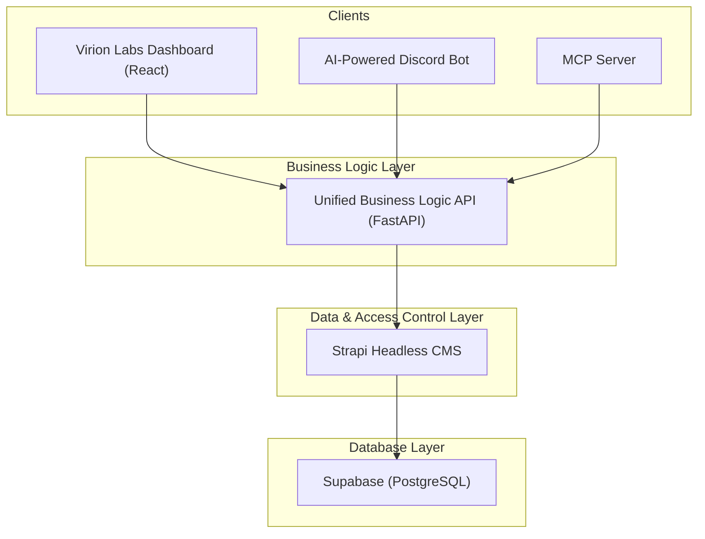

# Virion Labs Ecosystem: A Holistic Overview

## 1. Executive Summary

The Virion Labs platform is undergoing a significant architectural evolution, moving from a tightly coupled system to a modern, decoupled architecture. This new design is centered around a **Unified Business Logic API** and a **Strapi Headless CMS**, providing a robust, scalable, and secure foundation for all client applications, including the Dashboard, the MCP Server, and the new AI-powered Discord Bot.

This document provides a comprehensive overview of the entire ecosystem, synthesizing the information from various planning and implementation documents into a single, coherent guide.

## 2. Target Architecture

The new architecture is designed to centralize business logic, decouple clients from the database, and streamline development.

*   **Clients**: The Dashboard, Discord Bot, and MCP Server are the primary clients. They are responsible for the user interface and user experience, but they do not contain any business logic.
*   **Unified Business Logic API**: This FastAPI application is the single source of truth for all business processes. It orchestrates workflows, enforces security rules, and communicates with the data layer.
*   **Strapi Headless CMS**: Strapi is responsible for all data management, including CRUD operations, schema management, and user roles and permissions. It acts as the interface to the database.
*   **Supabase (PostgreSQL)**: The underlying database where all the data is stored.

## 3. Platform Refactoring and Migration

The transition to the new architecture is being executed in a phased approach to minimize risk and ensure a smooth rollout.

### Project Status: 🚀 Phase 4 In Progress

*   **Phase 1: Foundation & Setup (✅ Done)**: The Strapi project and the new Business Logic API package have been created.
*   **Phase 2: Data Modeling in Strapi (✅ Done)**: All database tables have been recreated as Strapi Content-Types, and user roles have been configured.
*   **Phase 3: Build Unified API (⏳ In Progress)**: The core API structure and authentication system are complete. The focus is now on building out the remaining business logic endpoints.
*   **Phase 4: Client Migration (⏳ In Progress)**:
    *   **MCP Server**: ✅ Successfully migrated.
    *   **Dashboard**: ❌ To Do.
    *   **Discord Bot**: ❌ To Do.

## 4. AI Integration Strategy

The platform is evolving to include a new **AI-powered Discord Bot** (`virion-labs-discord-bot-ai`) that will provide a conversational user experience for onboarding and campaign discovery.

### Key Principles:

*   **Admin-Centric Workflow**: The AI bot is not a fully autonomous chatbot. It uses AI to understand user intent and collect information, but the final decision-making (e.g., approving an application) is still done by a human administrator via the MCP Server.
*   **Conversational Onboarding**: The bot will guide users through a series of questions in a natural, conversational way, using a lightweight NLU model to extract and validate answers.
*   **Asynchronous Ticket System**: Completed onboarding conversations are saved as `OnboardingTicket`s. Administrators review these tickets asynchronously in their AI chat interface (e.g., Claude Desktop) and use MCP tools to process them.

## 5. Security and Authentication

The new architecture introduces a centralized and robust security model.

*   **Strapi as the Auth Server**: Strapi is the single source of truth for user identity and authentication, handling OAuth 2.0 integration with providers like Google.
*   **Business Logic API as the Auth Gateway**: The API acts as a secure gateway, redirecting clients to Strapi for authentication and providing a token introspection endpoint (`/api/auth/me`) for clients to validate tokens.
*   **Authentication vs. Authorization**: The system clearly distinguishes between:
    *   **Authentication (AuthN)**: Verifying a user's identity (handled by Strapi).
    *   **Authorization (AuthZ)**: Determining what an authenticated user is allowed to do (enforced by the business logic in the API).
*   **Secure-by-Default**: All new endpoints are developed with a "secure-by-default" pattern, where authorization is the first step in any service function.

## 6. User Journeys

The platform is designed to support the distinct journeys of its key user roles.

*   **Discord Member**: The end-user who joins the community, discovers campaigns, and goes through the onboarding process.
*   **Influencer**: The promoter who generates referral links, tracks their performance, and requests access to campaigns.
*   **Client**: The brand that creates, manages, and monitors the performance of their campaigns.
*   **Platform Administrator**: The operator who manages the entire platform, including clients, campaigns, and bots, primarily through the MCP Server.

Each of these journeys is supported by a specific set of workflows and operations in the Unified Business Logic API, ensuring a consistent and secure experience for all users.