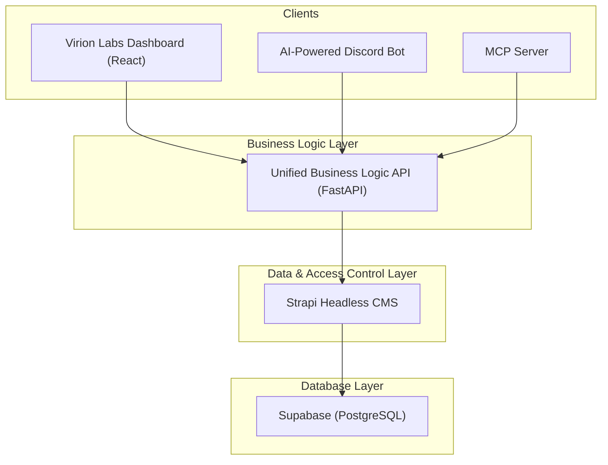

# 01: System Architecture and Plan

## 1. Overview

### The Problem
The current architecture has the Dashboard and Discord Bot tightly coupled to the Supabase database schema. This makes the system fragile, difficult to maintain, and hard to test. Changes in one service can unexpectedly break another.

### The Solution
We will implement a new, decoupled architecture that introduces a **Unified API** for business logic and a **Strapi Headless CMS** for data and access control. This will create a robust, scalable, and maintainable system.

### Benefits
*   **Decoupling:** The frontend and bot will no longer have knowledge of the database, preventing cascading failures.
*   **Rapid Development:** Strapi will handle all CRUD operations, schema management, and user permissions, saving immense development time.
*   **Centralized Logic:** The Unified API becomes the single source of truth for all business processes.
*   **Enhanced Security:** Granular access control will be managed in Strapi, and clients will no longer need direct database credentials.

---

## 2. Target Architecture

The new data flow will be as follows:

---

## 3. Implementation Strategy

### Core Philosophy
We will create a dedicated **Unified Business Logic API** package that focuses on sophisticated workflow orchestration using Strapi. This eliminates any risk to existing systems while providing the enhanced business logic capabilities required for the entire platform.

### Phased Implementation Plan

This migration will be conducted in distinct phases to minimize risk and ensure a smooth transition.

#### **Phase 1: Foundation & Setup (Complete)**
*   `[x]` Strapi project is set up and connected to the Supabase database.
*   `[x]` The existing `/packages/api/` will be replaced by the new Unified API.
*   `[x]` The new `/packages/virion-labs-business-logic-api/` package will be created.

#### **Phase 2: Data Modeling & Access Control in Strapi (Complete)**
*   `[x]` All database tables are re-created as Strapi Content-Types.
*   `[x]` All user roles (`Admin`, `Client`, `Influencer`, etc.) and their permissions are configured in Strapi.

#### **Phase 3: Build the Unified Business Logic API**
*   `[ ]` Implement the core API structure with a domain-driven design.
*   `[ ]` Build out the four categories of endpoints:
    *   `/api/v1/workflows/` - For multi-step business processes.
    *   `/api/v1/operations/` - For complex, single-step business actions.
    *   `/api/v1/integrations/` - For external service communications.
    *   `/api/v1/admin/` - For platform administration and analytics.
*   `[ ]` Write comprehensive tests for the new API.

#### **Phase 4: Client Migration**
*   `[ ]` **MCP Server:** Update the MCP server to use the new Unified API, following the `04_MCP_SERVER_MIGRATION_PLAN.md`.
*   `[ ]` **Dashboard & Bot:** Plan and execute the migration of the Dashboard and Discord Bot to use the new Unified API, removing their direct database access.

---

## 4. API Endpoint Structure

The Unified API will be organized by function, not by user role.

*   **`/api/v1/workflows/`**
    *   **Purpose:** Multi-step, automated business processes.
    *   **Examples:** `POST /campaign/create`, `POST /onboarding/complete`.
*   **`/api/v1/operations/`**
    *   **Purpose:** Complex, single-step business actions that require logic.
    *   **Examples:** `POST /campaign/deploy`, `GET /analytics/calculate-roi`.
*   **`/api/v1/integrations/`**
    *   **Purpose:** Endpoints for communicating with external services.
    *   **Examples:** `POST /discord/server-join`, `POST /webhooks/stripe`.
*   **`/api/v1/admin/`**
    *   **Purpose:** Endpoints for platform-wide administration and analytics.
    *   **Examples:** `GET /analytics/platform-overview`, `POST /client/provision`.
