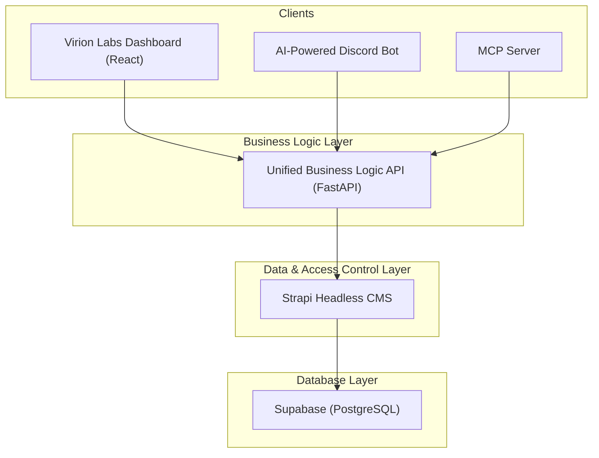

# 01: System Architecture and Plan

## 1. Overview

### The Problem
The current architecture has the Dashboard and Discord Bot tightly coupled to the Supabase database schema. This makes the system fragile, difficult to maintain, and hard to test. Changes in one service can unexpectedly break another.

### The Solution
We will implement a new, decoupled architecture that introduces a **Unified API** for business logic and a **Strapi Headless CMS** for data and access control. This will create a robust, scalable, and maintainable system.

### Benefits
*   **Decoupling:** The frontend and bot will no longer have knowledge of the database, preventing cascading failures.
*   **Rapid Development:** Strapi will handle all CRUD operations, schema management, and user permissions, saving immense development time.
*   **Centralized Logic:** The Unified API becomes the single source of truth for all business processes.
*   **Enhanced Security:** Granular access control will be managed in Strapi, and clients will no longer need direct database credentials.

---

## 2. Target Architecture

The new data flow will be as follows:

---

## 3. Implementation Strategy

### Core Philosophy
We will create a dedicated **Unified Business Logic API** package that focuses on sophisticated workflow orchestration using Strapi. This eliminates any risk to existing systems while providing the enhanced business logic capabilities required for the entire platform.

### Phased Implementation Plan

This migration will be conducted in distinct phases to minimize risk and ensure a smooth transition.

#### **Phase 1: Foundation & Setup (Complete)**
*   `[x]` Strapi project is set up and connected to the Supabase database.
*   `[x]` The new `/packages/virion-labs-business-logic-api/` package will be created to replace the legacy API.

#### **Phase 2: Data Modeling & Access Control in Strapi (Complete)**
*   `[x]` All database tables are re-created as Strapi Content-Types.
*   `[x]` All user roles (`Admin`, `Client`, `Influencer`, etc.) and their permissions are configured in Strapi.

#### **Phase 3: Build the Unified Business Logic API**
*   `[ ]` Implement the core API structure with a domain-driven design.
*   `[ ]` Build out the full suite of endpoints as defined in the **API Endpoint Structure** and **Implementation Blueprint** sections below.
*   `[ ]` Write comprehensive tests for the new API.

#### **Phase 4: Client Migration**
*   `[ ]` **MCP Server:** Update the MCP server to use the new Unified API, following the `04_MCP_SERVER_MIGRATION_PLAN.md`.
*   `[ ]` **Dashboard & Bot:** Plan and execute the migration of the Dashboard and Discord Bot to use the new Unified API, removing their direct database access.

---

## 4. Security & Permissions

While Strapi provides excellent Role-Based Access Control (RBAC), the Unified API's business logic layer is responsible for enforcing finer-grained permissions.

*   **Role-Based Access:** Strapi will define what *types* of actions a user role can perform (e.g., a `Client` role can create campaigns).
*   **Ownership-Based Access:** The API's service layer must enforce ownership. Before performing any action, it will verify that the authenticated user owns the resource they are trying to modify (e.g., `campaign.client_id == authenticated_user.client_id`). This prevents a user from editing another user's data.
*   **Admin Privileges:** Admin users will bypass ownership checks for management and support purposes. This logic will be explicitly coded and audited within the API.

---

## 5. API Endpoint Structure

The Unified API will be organized by **function**, not by user role, to promote logic reuse and maintainability.

*   **`/api/v1/workflows/`**
    *   **Purpose:** Multi-step, automated business processes that may involve multiple services or complex state changes.
    *   **Examples:** `POST /client/onboard`, `POST /campaign/create`, `POST /onboarding/complete`.
*   **`/api/v1/operations/`**
    *   **Purpose:** Complex, single-step business actions that require significant logic but are not multi-step workflows.
    *   **Examples:** `POST /campaign/deploy`, `GET /analytics/calculate-roi`, `GET /platform/overview`.
*   **`/api/v1/integrations/`**
    *   **Purpose:** Endpoints for communicating with external services or handling incoming webhooks.
    *   **Examples:** `POST /discord/server-join`, `POST /webhooks/stripe`.

---

## 6. Implementation Blueprint

This section provides a comprehensive list of the key workflows and operations to be built.

### Workflows (`/api/v1/workflows/...`)
*   **Client Onboarding:**
    *   `POST /client/start-wizard`: Initiates the client onboarding process.
    *   `POST /client/provision`: (Admin) Provisions a new client account and all associated infrastructure.
*   **Campaign Lifecycle:**
    *   `POST /campaign/create`: Creates a new campaign with all its initial settings.
    *   `POST /campaign/archive`: Archives a campaign, cleans up data, and generates final reports.
*   **User Onboarding:**
    *   `POST /onboarding/start`: Initiates the onboarding flow for a new Discord member.
    *   `POST /onboarding/complete`: Finalizes onboarding, saves responses, and assigns roles.
*   **Referral Tracking:**
    *   `POST /referral/generate-link`: Creates a new trackable referral link for an influencer.
    *   `POST /referral/track-click`: Tracks a click on a referral link.
    *   `POST /referral/track-conversion`: Tracks a successful conversion from a referral.
*   **Campaign Access:**
    *   `POST /campaign-access/request`: Allows an influencer to request access to a campaign.
    *   `POST /campaign-access/approve`: (Admin) Approves an influencer's access request.
    *   `POST /campaign-access/deny`: (Admin) Denies an influencer's access request.

### Operations (`/api/v1/operations/...`)
*   **Campaign Management:**
    *   `POST /campaign/deploy`: Deploys a campaign and activates its bot.
    *   `POST /campaign/pause`: Pauses a running campaign.
    *   `POST /campaign/resume`: Resumes a paused campaign.
    *   `PUT /campaign/configure-branding`: Updates the branding for a campaign's bot.
*   **Analytics & Reporting:**
    *   `GET /analytics/dashboard`: Generates dashboard data for a Client or Influencer.
    *   `GET /analytics/roi`: Calculates ROI for a specific campaign.
    *   `GET /analytics/performance-report`: Generates a detailed performance report.
    *   `GET /analytics/influencer-metrics`: Calculates metrics for a specific influencer.
*   **Platform Administration:**
    *   `GET /platform/overview`: (Admin) Generates a comprehensive overview of the entire platform.
    *   `GET /platform/health`: (Admin) Monitors the health of the platform's systems.
    *   `POST /platform/maintenance-mode`: (Admin) Toggles maintenance mode for the platform.
*   **Bot & Client Management (Admin):**
    *   `POST /bot/deploy`: (Admin) Deploys a new Discord bot instance for a client.
    *   `GET /client/list`: (Admin) Lists all clients on the platform.
    *   `PUT /client/{id}`: (Admin) Updates a client's details.
    *   `DELETE /client/{id}`: (Admin) Deletes a client account.

### Integrations (`/api/v1/integrations/...`)
*   **Discord:**
    *   `POST /discord/server-join`: Handles a new user joining a Discord server.
    *   `POST /discord/role-assignment`: Manages assigning roles to users in Discord.
    *   `POST /discord/slash-command`: Entry point for handling slash commands from the Discord bot.
*   **External Webhooks:**
    *   `POST /webhooks/{source}`: A generic endpoint to receive and process webhooks from various third-party services (e.g., Stripe, GitHub).
