# 03: User Journeys and API Reference

This document provides a comprehensive overview of the user roles, their journeys, and the API endpoints that support their actions, reflecting the unified, function-based API structure.

---

## 1. The Discord Member: The End-User

### Role Description
The Discord Member is the target audience for campaigns. Their journey is typically initiated by a referral link or an interaction within a Discord server.

### User Stories
*   As a Discord Member, I want to click a referral link to easily join a community.
*   As a Discord Member, I want to be automatically guided through an onboarding process when I join.
*   As a Discord Member, I want to use simple slash commands like `/join` to discover campaigns.
*   As a Discord Member, I want to fill out a simple form inside Discord to get special roles.

### Detailed User Journey

```mermaid
graph TD
    subgraph "User Journey: From First Click to Full Participant"
        A["Start"] --> B{"How was the campaign found?"};
        B --> C["Path 1: Referral Link"];
        B --> D["Path 2: Direct Discovery in Discord"];

        subgraph "Path 1: Referral Link Flow"
            C --> C1["User clicks referral link"];
            C1 --> C1_API["API: POST /api/v1/workflows/referral/track-click"];
            C1_API --> C2["User clicks 'Join' on landing page"];
            C2 --> C2_API["API: POST /api/v1/integrations/discord/generate-invite"];
            C2_API --> C3["User joins Discord server"];
            C3 --> C3_API["API: POST /api/v1/workflows/referral/track-conversion"];
            C3_API --> Onboarding;
        end

        subgraph "Path 2: Direct Discovery Flow"
            D --> D1["User types /join"];
            D1 --> D1_API["API: GET /api/v1/operations/campaign/list"];
            D1_API --> D2["User clicks 'Start Onboarding'"];
            D2 --> Onboarding;
        end

        subgraph "Onboarding Process (Both Paths Converge)"
            Onboarding["Onboarding Starts"] --> O1_API["API: POST /api/v1/workflows/onboarding/start"];
            O1_API --> O2["User submits form"];
            O2 --> O2_API["API: POST /api/v1/workflows/onboarding/complete"];
            O2_API --> End["End: User gets role & participates"];
        end
    end
```

### Supporting API Endpoints
*   `POST /api/v1/workflows/referral/track-click`
*   `POST /api/v1/workflows/referral/track-conversion`
*   `POST /api/v1/workflows/onboarding/start`
*   `POST /api/v1/workflows/onboarding/complete`
*   `POST /api/v1/integrations/discord/server-join`

---

## 2. The Influencer: The Promoter

### Role Description
The Influencer drives user acquisition. They are focused on performance and monetization.

### User Stories
*   As an Influencer, I want to sign up to the platform easily.
*   As an Influencer, I want to create unique, trackable referral links.
*   As an Influencer, I want to track the performance of my links in real-time.
*   As an Influencer, I want to discover and request access to new marketing campaigns.

### Supporting API Endpoints
*   `POST /api/v1/workflows/referral/generate-link`
*   `POST /api/v1/workflows/campaign-access/request`
*   `GET /api/v1/operations/analytics/dashboard`
*   `GET /api/v1/operations/analytics/influencer-metrics`

---

## 3. The Client: The Brand

### Role Description
The Client is the brand that funds and directs marketing campaigns. They require tools for campaign management, customization, and measuring ROI.

### User Stories
*   As a Client, I want an onboarding wizard to create my first campaign.
*   As a Client, I want to create and manage multiple campaigns from a dashboard.
*   As a Client, I want to customize a Discord bot with my own branding.
*   As a Client, I want to track key metrics and view the ROI of my marketing spend.
*   As a Client, I want to pause, resume, or archive campaigns.

### Supporting API Endpoints
*   `POST /api/v1/workflows/client/start-wizard`
*   `POST /api/v1/workflows/campaign/create`
*   `POST /api/v1/workflows/campaign/archive`
*   `POST /api/v1/operations/campaign/deploy`
*   `POST /api/v1/operations/campaign/pause`
*   `POST /api/v1/operations/campaign/resume`
*   `PUT /api/v1/operations/campaign/configure-branding`
*   `GET /api/v1/operations/analytics/dashboard`
*   `GET /api/v1/operations/analytics/roi`
*   `GET /api/v1/operations/analytics/performance-report`

---

## 4. The Platform Administrator: The Operator

### Role Description
The Administrator is a Virion Labs user responsible for the overall health and management of the platform. They have the highest level of access and perform their duties through clients like the MCP Server or an Admin Dashboard.

### User Stories
*   As an Administrator, I want a global view of all clients, influencers, and campaigns.
*   As an Administrator, I want to manage client accounts (add, view, edit, delete).
*   As an Administrator, I want to deploy and manage Discord bots for clients.
*   As an Administrator, I want to approve or deny influencer requests for campaigns.

### Supporting API Endpoints
*   **Note:** Admin actions use the same functional endpoints as other users, but their permissions grant them broader access (e.g., to see all clients, not just their own).

*   `POST /api/v1/workflows/client/provision`
*   `POST /api/v1/workflows/campaign-access/approve`
*   `POST /api/v1/workflows/campaign-access/deny`
*   `GET /api/v1/operations/platform/overview`
*   `GET /api/v1/operations/platform/health`
*   `POST /api/v1/operations/platform/maintenance-mode`
*   `POST /api/v1/operations/bot/deploy`
*   `GET /api/v1/operations/client/list`
*   `PUT /api/v1/operations/client/{id}`
*   `DELETE /api/v1/operations/client/{id}`
