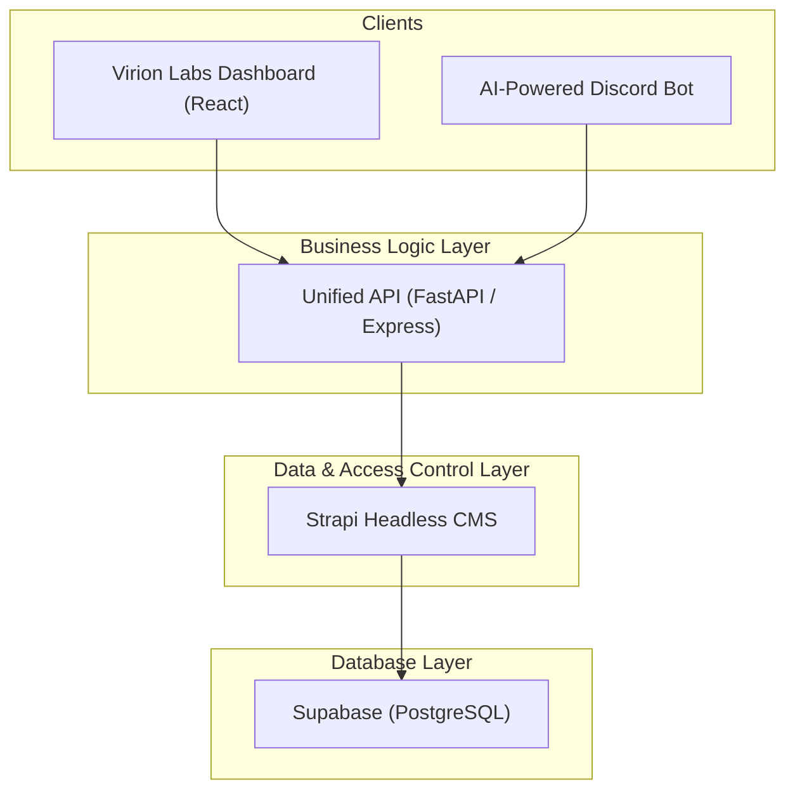

# Comprehensive Implementation Plan: Migrating to a Strapi-Powered Architecture

## 1. Overview

**The Problem:** The current architecture has the Dashboard and Discord Bot tightly coupled to the Supabase database schema. This makes the system fragile, difficult to maintain, and hard to test. Changes in one service can unexpectedly break another.

**The Solution:** We will implement a new, decoupled architecture that introduces a **Unified API** for business logic and a **Strapi Headless CMS** for data and access control. This will create a robust, scalable, and maintainable system.

**Benefits:**
*   **Decoupling:** The frontend and bot will no longer have knowledge of the database, preventing cascading failures.
*   **Rapid Development:** Strapi will handle all CRUD operations, schema management, and user permissions, saving immense development time.
*   **Centralized Logic:** The Unified API becomes the single source of truth for all business processes.
*   **Enhanced Security:** Granular access control will be managed in Strapi, and clients will no longer need direct database credentials.

---

## 2. Target Architecture

The new data flow will be as follows:

---

## 3. Phased Implementation Plan

This migration will be conducted in five distinct phases to minimize risk and ensure a smooth transition.

### **Phase 1: Foundation & Setup**

*Objective: Prepare the development environment and get the new services running.*

*   `[ ]` **1.1. Set up Strapi Project:**
    *   Create a new Strapi project in the `packages` directory: `npx create-strapi-app@latest api-data-layer --quickstart`.
    *   This will be our Data & Access Control Layer.

*   `[ ]` **1.2. Configure Strapi Database:**
    *   In the Strapi project, install the `pg` connector: `npm install pg`.
    *   Configure Strapi to connect to your existing Supabase database. You can find the connection string in your Supabase project settings (`Settings` > `Database`). Update the Strapi database config file (`./config/database.js`).

*   `[ ]` **1.3. Set up Unified API Project:**
    *   Create a new project for our business logic API in the `packages` directory (e.g., using a FastAPI or Express.js starter). Name it `api-business-logic`.

*   `[ ]` **1.4. Version Control:**
    *   Ensure both new packages (`api-data-layer` and `api-business-logic`) are included in your Git repository.

### **Phase 2: Data Modeling & Access Control in Strapi**

*Objective: Replicate the entire data schema and permission model within Strapi, making it the new source of truth for data structure.*

*   `[ ]` **2.1. Create Content-Types:**
    *   Using the Strapi Admin Panel, go to the **Content-Type Builder**.
    *   Re-create all your existing database tables as Strapi Content-Types. Key models include:
        *   `Campaign`
        *   `Influencer`
        *   `ReferralLink`
        *   `OnboardingResponse`
        *   `AnalyticsEvent`
    *   Define all fields and, crucially, the **relations** between them (e.g., a `Campaign` has many `OnboardingResponses`).

*   `[ ]` **2.2. Configure User Roles & Permissions:**
    *   Go to `Settings` > `Roles & Permissions`.
    *   Define the necessary roles: `Admin`, `Client`, `Influencer`, `Authenticated` (for Discord members), and `Public`.
    *   For each role, configure the permissions for every Content-Type. For example, an `Influencer` can `find` and `findOne` of their own `ReferralLinks`, but cannot `delete` them. This is a critical step for security.

*   `[ ]` **2.3. Data Migration (Optional but Recommended):**
    *   If you have existing data, write a one-time script to pull data from the old tables and push it into the new Strapi-managed tables via its API.

### **Phase 3: Building the Unified Business Logic API**

*Objective: Implement business workflows and operations that orchestrate calls to the Strapi API.*

*   `[ ]` **3.1. Implement Core API Structure:**
    *   Set up the following endpoint categories in your business logic API:
        *   `/api/v1/workflows/` - Multi-step business processes
        *   `/api/v1/operations/` - Complex operations and calculations  
        *   `/api/v1/integrations/` - External service integrations

*   `[ ]` **3.2. Implement Workflow Endpoints:**
    *   **Onboarding Workflows:**
        *   `GET /api/v1/workflows/onboarding/start` - Initiate user onboarding
        *   `POST /api/v1/workflows/onboarding/complete` - Complete onboarding with role assignment
    *   **Campaign Access Workflows:**
        *   `POST /api/v1/workflows/campaign-access/request` - Request campaign access
        *   `POST /api/v1/workflows/campaign-access/approve` - Approve access requests
        *   `POST /api/v1/workflows/campaign-access/deny` - Deny access requests
    *   **Referral Tracking Workflows:**
        *   `POST /api/v1/workflows/referral-tracking/generate-link` - Create trackable links
        *   `POST /api/v1/workflows/referral-tracking/click` - Track link clicks
        *   `POST /api/v1/workflows/referral-tracking/convert` - Track conversions
    *   **Client Onboarding Workflows:**
        *   `POST /api/v1/workflows/client-onboarding/start-wizard` - Start client setup
        *   `POST /api/v1/workflows/client-onboarding/create-first-campaign` - Complete setup

*   `[ ]` **3.3. Implement Operation Endpoints:**
    *   **Campaign Operations:**
        *   `POST /api/v1/operations/campaign/deploy` - Deploy campaign with bot setup
        *   `POST /api/v1/operations/campaign/pause` - Pause campaign operations
        *   `POST /api/v1/operations/campaign/resume` - Resume campaign
        *   `POST /api/v1/operations/campaign/archive` - Archive with cleanup
        *   `PUT /api/v1/operations/campaign/configure-branding` - Update bot branding
    *   **Analytics Operations:**
        *   `GET /api/v1/operations/analytics/generate-dashboard` - Generate dashboard data
        *   `GET /api/v1/operations/analytics/calculate-roi` - Calculate ROI metrics
        *   `GET /api/v1/operations/analytics/performance-report` - Generate reports
        *   `GET /api/v1/operations/analytics/influencer-metrics` - Influencer analytics
    *   **Admin Operations:**
        *   `POST /api/v1/operations/admin/provision-client` - Setup new client
        *   `POST /api/v1/operations/admin/deploy-bot` - Deploy Discord bot
        *   `GET /api/v1/operations/admin/platform-overview` - Platform analytics

*   `[ ]` **3.4. Implement Integration Endpoints:**
    *   **Discord Integrations:**
        *   `POST /api/v1/integrations/discord/server-join` - Handle server joins
        *   `POST /api/v1/integrations/discord/role-assignment` - Assign roles
        *   `POST /api/v1/integrations/discord/slash-commands` - Handle bot commands
    *   **External Integrations:**
        *   `POST /api/v1/integrations/external/webhook-handler` - Process webhooks
        *   `POST /api/v1/integrations/external/payment-processor` - Handle payments

*   `[ ]` **3.5. Example Implementation Pattern:**
    *   **Business Logic Workflow (`POST /api/v1/workflows/onboarding/complete`):**
        1.  Validate request data and user permissions
        2.  Call Strapi: `POST /api/onboarding-responses` - Save answers
        3.  Call Strapi: `GET /api/users/{id}` - Fetch user data
        4.  Call Strapi: `PUT /api/users/{id}` - Update user role
        5.  Call Discord API: Assign server role
        6.  Call Strapi: `POST /api/analytics-events` - Track completion
        7.  Return structured response with next steps

*   `[ ]` **3.6. Implement Authentication & Authorization:**
    *   JWT-based authentication for dashboard and bot clients
    *   Role-based access control (Admin, Client, Influencer)
    *   API key authentication for bot operations
    *   Rate limiting and request validation

### **Phase 4: Client Refactoring & Integration**

*Objective: Incrementally update the Dashboard and Discord Bot to use the new Unified API instead of directly accessing Supabase.*

*   `[ ]` **4.1. Refactor the Dashboard:**
    *   Create a new API service/client within the dashboard project to handle all communication with the Business Logic API.
    *   Replace direct Supabase calls with business logic API calls:
        *   Dashboard data: `GET /api/v1/operations/analytics/generate-dashboard`
        *   Campaign creation: `POST /api/v1/workflows/client-onboarding/create-first-campaign`
        *   Campaign management: `/api/v1/operations/campaign/*` endpoints
        *   Analytics: `/api/v1/operations/analytics/*` endpoints
    *   Start with read-only features (analytics, dashboards) before moving to write operations.

*   `[ ]` **4.2. Refactor the Discord Bot:**
    *   Replace all direct Supabase queries with Business Logic API calls:
        *   `/join` command: `GET /api/v1/workflows/onboarding/start`
        *   Onboarding completion: `POST /api/v1/workflows/onboarding/complete`
        *   Referral tracking: `/api/v1/workflows/referral-tracking/*` endpoints
        *   Server events: `/api/v1/integrations/discord/*` endpoints
    *   Update slash command handlers to use workflow endpoints instead of direct database access.

### **Phase 5: Decommissioning & Finalization**

*Objective: Remove the old, tightly-coupled connections to finalize the migration and prevent regressions.*

*   `[ ]` **5.1. Remove Old Dependencies:**
    *   Once the dashboard and bot are fully migrated, **uninstall** the Supabase client library (`@supabase/supabase-js`) from both projects.

*   `[ ]` **5.2. Clean Up Code:**
    *   Delete all old code related to direct database access.

*   `[ ]` **5.3. Update Environment Variables:**
    *   Remove the `SUPABASE_URL` and `SUPABASE_ANON_KEY` from the `.env` files of the dashboard and bot.
    *   Add the new `BUSINESS_LOGIC_API_URL` and `BUSINESS_LOGIC_API_KEY`.
    *   Configure Strapi connection details for the business logic API only.

*   `[ ]` **5.4. Final Review:**
    *   Conduct a final architecture review to confirm that all services are communicating through the correct channels and that the decoupling is complete.
