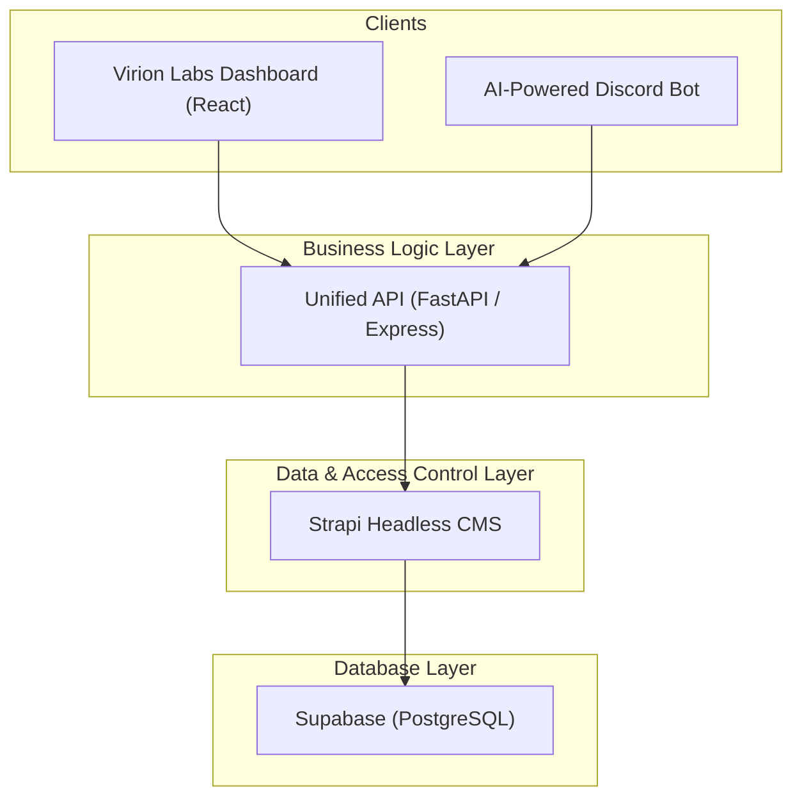

# Comprehensive Implementation Plan: Migrating to a Strapi-Powered Architecture

## 1. Overview

**The Problem:** The current architecture has the Dashboard and Discord Bot tightly coupled to the Supabase database schema. This makes the system fragile, difficult to maintain, and hard to test. Changes in one service can unexpectedly break another.

**The Solution:** We will implement a new, decoupled architecture that introduces a **Unified API** for business logic and a **Strapi Headless CMS** for data and access control. This will create a robust, scalable, and maintainable system.

**Benefits:**
*   **Decoupling:** The frontend and bot will no longer have knowledge of the database, preventing cascading failures.
*   **Rapid Development:** Strapi will handle all CRUD operations, schema management, and user permissions, saving immense development time.
*   **Centralized Logic:** The Unified API becomes the single source of truth for all business processes.
*   **Enhanced Security:** Granular access control will be managed in Strapi, and clients will no longer need direct database credentials.

---

## 2. Target Architecture

The new data flow will be as follows:

---

## 3. Phased Implementation Plan

This migration will be conducted in five distinct phases to minimize risk and ensure a smooth transition.

### **Phase 1: Foundation & Setup**

*Objective: Prepare the development environment and get the new services running.*

*   `[ ]` **1.1. Set up Strapi Project:**
    *   Create a new Strapi project in the `packages` directory: `npx create-strapi-app@latest api-data-layer --quickstart`.
    *   This will be our Data & Access Control Layer.

*   `[ ]` **1.2. Configure Strapi Database:**
    *   In the Strapi project, install the `pg` connector: `npm install pg`.
    *   Configure Strapi to connect to your existing Supabase database. You can find the connection string in your Supabase project settings (`Settings` > `Database`). Update the Strapi database config file (`./config/database.js`).

*   `[ ]` **1.3. Set up Unified API Project:**
    *   Create a new project for our business logic API in the `packages` directory (e.g., using a FastAPI or Express.js starter). Name it `api-business-logic`.

*   `[ ]` **1.4. Version Control:**
    *   Ensure both new packages (`api-data-layer` and `api-business-logic`) are included in your Git repository.

### **Phase 2: Data Modeling & Access Control in Strapi**

*Objective: Replicate the entire data schema and permission model within Strapi, making it the new source of truth for data structure.*

*   `[ ]` **2.1. Create Content-Types:**
    *   Using the Strapi Admin Panel, go to the **Content-Type Builder**.
    *   Re-create all your existing database tables as Strapi Content-Types. Key models include:
        *   `Campaign`
        *   `Influencer`
        *   `ReferralLink`
        *   `OnboardingResponse`
        *   `AnalyticsEvent`
    *   Define all fields and, crucially, the **relations** between them (e.g., a `Campaign` has many `OnboardingResponses`).

*   `[ ]` **2.2. Configure User Roles & Permissions:**
    *   Go to `Settings` > `Roles & Permissions`.
    *   Define the necessary roles: `Admin`, `Client`, `Influencer`, `Authenticated` (for Discord members), and `Public`.
    *   For each role, configure the permissions for every Content-Type. For example, an `Influencer` can `find` and `findOne` of their own `ReferralLinks`, but cannot `delete` them. This is a critical step for security.

*   `[ ]` **2.3. Data Migration (Optional but Recommended):**
    *   If you have existing data, write a one-time script to pull data from the old tables and push it into the new Strapi-managed tables via its API.

### **Phase 3: Building the Unified API**

*Objective: Implement the core business logic that orchestrates calls to the Strapi API.*

*   `[ ]` **3.1. Reference the Checklist:**
    *   Use the `USER_BASED_API_ENDPOINT_CHECKLIST.md` as your guide for which endpoints to build.

*   `[ ]` **3.2. Implement Endpoints:**
    *   For each endpoint, write the business logic. This logic will make authenticated calls to the Strapi API.
    *   **Example Workflow (`/api/onboarding/complete`):**
        1.  Receive the request from the Discord Bot.
        2.  Call Strapi to save the onboarding answers: `POST /api/onboarding-responses`.
        3.  Call Strapi to fetch the user's data: `GET /api/users/{id}`.
        4.  Call Strapi to update the user with their new role: `PUT /api/users/{id}`.
        5.  Return a success message to the bot.

*   `[ ]` **3.3. Implement Authentication:**
    *   The Unified API itself needs to be secure. Implement a token-based authentication system (e.g., JWT) for clients like the dashboard and the bot.

### **Phase 4: Client Refactoring & Integration**

*Objective: Incrementally update the Dashboard and Discord Bot to use the new Unified API instead of directly accessing Supabase.*

*   `[ ]` **4.1. Refactor the Dashboard:**
    *   Create a new API service/client within the dashboard project to handle all communication with the Unified API.
    *   Go through the dashboard feature by feature. Replace every direct Supabase call (`supabase.from(...).select()`) with a call to the new API service.
    *   Start with read-only features (e.g., listing campaigns) before moving to write operations.

*   `[ ]` **4.2. Refactor the Discord Bot:**
    *   Follow the same process for the `virion-labs-discord-bot`.
    *   Replace all direct Supabase queries with calls to the Unified API.
    *   The `/join` command, for example, will now call `GET /api/campaigns/available` from your Unified API.

### **Phase 5: Decommissioning & Finalization**

*Objective: Remove the old, tightly-coupled connections to finalize the migration and prevent regressions.*

*   `[ ]` **5.1. Remove Old Dependencies:**
    *   Once the dashboard and bot are fully migrated, **uninstall** the Supabase client library (`@supabase/supabase-js`) from both projects.

*   `[ ]` **5.2. Clean Up Code:**
    *   Delete all old code related to direct database access.

*   `[ ]` **5.3. Update Environment Variables:**
    *   Remove the `SUPABASE_URL` and `SUPABASE_ANON_KEY` from the `.env` files of the dashboard and bot.
    *   Add the new `UNIFIED_API_URL` and `UNIFIED_API_KEY`.

*   `[ ]` **5.4. Final Review:**
    *   Conduct a final architecture review to confirm that all services are communicating through the correct channels and that the decoupling is complete.
