# The Complete Discord Campaign User Journey: From Discovery to API Implementation

This document provides a single, authoritative guide to the entire user journey for Discord campaigns. It details the two paths a user can take to join a campaign, the specific analytics events tracked at every stage, and the comprehensive set of API endpoints designed to support this entire flow.

---

## The Full User Journey: An Integrated View

This section breaks down the complete user journey step-by-step, showing the user's action, the system's response, the API calls being made, and the analytics being captured.

### Path 1: Joining via a Referral Link

This is the journey for a user who discovers the campaign from a link outside of Discord.

**Step 1: User Clicks the Referral Link**
*   **User Action:** Clicks a link like `https://virion.gg/r/INFLUENCER_CODE`.
*   **System Response:** The user is directed to a campaign-specific landing page.
*   **API Call:** The landing page frontend immediately calls the analytics service.
    *   `POST /api/analytics/track`
*   **Analytics Tracked:** An event of type `click` is recorded.
    *   **Backend Effect:** This captures the user's IP and user agent, and increments the `clicks` counter on the `referral_links` table.

**Step 2: User Decides to Join**
*   **User Action:** Clicks the "Join Discord" button on the landing page.
*   **System Response:** The frontend makes an API call to get a unique, single-use Discord invite.
*   **API Call:**
    *   `POST /api/invites/managed` - This creates a temporary, tracked invite link.
*   **Analytics Tracked:** None at this specific step, as the action is part of the conversion flow.

**Step 3: User Joins the Discord Server**
*   **User Action:** The user is redirected to the unique Discord invite and joins the server.
*   **System Response:** The Discord bot's `ReferralHandler` detects the new member and the specific invite they used.
*   **API Calls:**
    *   `POST /api/referrals/convert` - This officially links the new Discord user to the referral campaign.
    *   `POST /api/analytics/track`
*   **Analytics Tracked:** An event of type `conversion` is recorded.
    *   **Backend Effect:** This links the `referral_link_id` to the new `discord_user_id` by creating a new entry in the `referrals` table. It also increments the `referral_conversions` counter on the `discord_guild_campaigns` table.

**Step 4: Onboarding Begins Automatically**
*   **User Action:** None. The process is automatic.
*   **System Response:** The bot's `OnboardingHandler` identifies the user and the campaign they joined and presents them with a pop-up form (modal) to begin onboarding.
*   **API Call:**
    *   `POST /api/analytics/track`
*   **Analytics Tracked:** An event of type `onboarding_start` is recorded.
    *   **Backend Effect:** A record is created in the `campaign_onboarding_starts` table. This is crucial for accurately measuring the drop-off rate (completions vs. starts).

---

### Path 2: Discovering Directly in Discord

This is the journey for a user who is already a member of the Discord server.

**Step 1: User Looks for Campaigns**
*   **User Action:** Navigates to a channel like `#join-campaigns` and types the `/join` command.
*   **System Response:** The bot's `InteractionHandler` prepares to show a list of available campaigns.
*   **API Calls:**
    *   `GET /api/campaigns/available` - Fetches the list of campaigns for that channel.
    *   `POST /api/analytics/track`
*   **Analytics Tracked:** An `interaction` event is recorded with `interaction_type: 'command'` and `command_name: '/join'`.
    *   **Backend Effect:** Increments the `total_interactions` and `commands_used` counters for the campaign in the `discord_guild_campaigns` table.

**Step 2: User Chooses a Campaign**
*   **User Action:** Clicks the "Start Onboarding" button for a specific campaign from the list.
*   **System Response:** The bot prepares to start the onboarding process for the selected campaign.
*   **API Call:**
    *   `POST /api/analytics/track`
*   **Analytics Tracked:** An `interaction` event is recorded with `interaction_type: 'button_click'`.
    *   **Backend Effect:** Increments the `total_interactions` counter.

**Step 3: Onboarding Begins**
*   **User Action:** The user sees the pop-up form (modal).
*   **System Response:** The bot's `OnboardingHandler` displays the onboarding form.
*   **API Call:**
    *   `POST /api/analytics/track`
*   **Analytics Tracked:** An event of type `onboarding_start` is recorded.
    *   **Backend Effect:** A record is created in the `campaign_onboarding_starts` table to accurately calculate the campaign's completion rate.

---

### The Final Steps (Where Both Paths Merge)

**Step 5: User Completes Onboarding**
*   **User Action:** Fills out the form and clicks "Submit".
*   **System Response:** The bot processes the submission.
*   **API Call:**
    *   `POST /api/campaigns/{campaign_id}/onboarding/responses` - The user's answers are saved to the database.

**Step 6: Onboarding is Marked as Complete**
*   **User Action:** None. This is a system action.
*   **System Response:** After the data is successfully saved, the bot confirms the completion and assigns the user their new role.
*   **API Call:**
    *   `POST /api/analytics/track`
*   **Analytics Tracked:** An event of type `onboarding_complete` is recorded.
    *   **Backend Effect:** A record is added to the `campaign_onboarding_completions` table, and the `successful_onboardings` counter on the `discord_guild_campaigns` table is incremented. This is the final success metric for the journey.

---

## Comprehensive API Endpoint Reference

### 1. Discovery & Configuration
*   **`GET /api/campaigns/available`**
    *   **Description:** Fetches active campaigns for a server/channel, including the `role_id` to be assigned on completion.
    *   **Params:** `guild_id` (required), `channel_id` (optional).
*   **`GET /api/referrals/{referral_code}/campaign`**
    *   **Description:** Retrieves public campaign details for a referral landing page.
    *   **Params:** `referral_code` (required).
*   **`POST /api/invites/managed`**
    *   **Description:** Creates a unique, single-use Discord invite for tracking referral conversions accurately.
    *   **Body:** `referral_code` (required), `guild_id` (required).

### 2. User Actions & Data Submission
*   **`POST /api/referrals/convert`**
    *   **Description:** Links a new Discord user to the referral campaign they joined through.
    *   **Body:** `referral_code`, `discord_user_id`, `discord_username`, `guild_id` (all required).
*   **`POST /api/campaigns/{campaign_id}/onboarding/responses`**
    *   **Description:** Submits the user's answers from the onboarding form.
    *   **Params:** `campaign_id` (required).
    *   **Body:** `discord_user_id`, `responses` (both required).

### 3. Centralized Analytics
*   **`POST /api/analytics/track`**
    *   **Description:** A single, flexible endpoint to record all analytics events. The backend service then updates the relevant database tables and counters based on the event type.
    *   **Body:**
        *   `event_type` (required): e.g., `click`, `conversion`, `interaction`, `onboarding_start`, `onboarding_complete`.
        *   `campaign_id`, `referral_link_id`, `user_id`, `guild_id` (all optional).
        *   `metadata` (optional): A JSON object for extra data (e.g., `ip_address`, `command_name`).

---

## Visual Diagram: The Full Journey with API Calls

```mermaid
graph TD
    subgraph "User Journey: From First Click to Full Participant"
        A["Start"] --> B{"How was the campaign found?"};
        B --> C["Path 1: Referral Link"];
        B --> D["Path 2: Direct Discovery"];

        subgraph "Path 1: Referral Link Flow"
            C --> C1["User clicks referral link"];
            C1 --> C1_API["API: POST /analytics/track (click)"];
            C1_API --> C2["User clicks 'Join' on landing page"];
            C2 --> C2_API["API: POST /invites/managed"];
            C2_API --> C3["User joins Discord server"];
            C3 --> C3_API["API: POST /referrals/convert & POST /analytics/track (conversion)"];
            C3_API --> Onboarding;
        end

        subgraph "Path 2: Direct Discovery Flow"
            D --> D1["User types /join"];
            D1 --> D1_API["API: GET /campaigns/available & POST /analytics/track (interaction)"];
            D1_API --> D2["User clicks 'Start Onboarding'"];
            D2 --> D2_API["API: POST /analytics/track (interaction)"];
            D2_API --> Onboarding;
        end

        subgraph "Onboarding Process (Both Paths Converge)"
            Onboarding["Onboarding Starts"] --> O1_API["API: POST /analytics/track (onboarding_start)"];
            O1_API --> O2["User submits form"];
            O2 --> O2_API["API: POST /campaigns/{id}/onboarding/responses"];
            O2_API --> O3_API["API: POST /analytics/track (onboarding_complete)"];
            O3_API --> End["End: User gets role & participates"];
        end
    end

    style C1_API fill:#d4edda,stroke:#155724
    style C2_API fill:#d1ecf1,stroke:#0c5460
    style C3_API fill:#d4edda,stroke:#155724
    style D1_API fill:#d1ecf1,stroke:#0c5460
    style D2_API fill:#d4edda,stroke:#155724
    style O1_API fill:#d4edda,stroke:#155724
    style O2_API fill:#d1ecf1,stroke:#0c5460
    style O3_API fill:#d4edda,stroke:#155724
    style End fill:#bfb,stroke:#333,stroke-width:2px
```

