# The Complete Discord Campaign User Journey (with Analytics Tracking)

This document provides a comprehensive, end-to-end overview of the user journey for Discord campaigns. It details the two primary paths a user can take to join a campaign—direct discovery and referral links—and explains the specific analytics events that are tracked at every stage.

## User Journey and Analytics Flow

The journey begins when a user first discovers a campaign and ends when they become an active participant. Analytics are captured at every significant interaction to provide a complete picture of campaign performance.

### Path 1: Discovery via Referral Link

This path is for users who find the campaign through a link shared outside of Discord.

1.  **User Clicks Referral Link:** The journey starts when a user clicks a unique campaign referral link.
    *   **Analytics Tracking (`click` event):**
        *   An API call is made to the backend to record a `click` event in the `referral_analytics` table.
        *   This captures the user's IP address, user agent, and referrer to understand the traffic source.
        *   The `clicks` counter on the `referral_links` table is incremented.

2.  **User Joins the Discord Server:** The user is redirected to a unique Discord invite and joins the server.
    *   **Analytics Tracking (`conversion` event):**
        *   The bot detects that the user joined via a managed invite link.
        *   The `ReferralHandler` service triggers the `AnalyticsService` to track a `conversion`.
        *   A new entry is created in the `referrals` table, linking the new Discord user to the influencer and campaign.
        *   An event is logged in `referral_analytics` to signify a successful conversion from the initial click.
        *   The `referral_conversions` counter on the `discord_guild_campaigns` table is incremented.

3.  **Automatic Onboarding:** Because the user's origin is known, the onboarding process for the specific campaign begins automatically.

### Path 2: Direct Discovery in Discord

This path is for users who are already members of the Discord server.

1.  **User Uses the `/join` Command:** A user in a designated channel (e.g., `#join-campaigns`) uses the `/join` command to see available campaigns.
    *   **Analytics Tracking (`interaction` and `command_used` events):**
        *   The bot's `InteractionHandler` calls the `AnalyticsService`.
        *   An event is logged to track that the `/join` command was used.
        *   This increments the `total_interactions` and `commands_used` counters for the campaign in the `discord_guild_campaigns` table.

2.  **User Selects a Campaign:** The bot displays a list of campaigns, and the user clicks the "Start Onboarding" button for their chosen campaign.
    *   **Analytics Tracking (`interaction` event):**
        *   Another `interaction` event is tracked for the button click, providing insight into which campaigns are most appealing from the list.
        *   This also increments the `total_interactions` count.

### The Onboarding Process (Where Both Paths Merge)

Whether the user arrived via a referral link or direct discovery, the onboarding process is the same.

1.  **Onboarding Begins:** The `OnboardingHandler` is triggered, and the bot presents the user with a pop-up form (a modal).
    *   **Analytics Tracking (`onboarding_start` event):**
        *   Before the modal is shown, the `AnalyticsService` is called to track that an onboarding process has officially started.
        *   A new record is created in the `campaign_onboarding_starts` table. This is a critical metric for accurately calculating the campaign's completion rate (completions vs. starts).

2.  **User Completes the Form:** The user fills out the required fields and submits the form.
    *   **Analytics Tracking (`onboarding_complete` event):**
        *   Upon successful submission, the `AnalyticsService` is called again.
        *   An event is tracked to signify that the onboarding is complete. A record is added to the `campaign_onboarding_completions` table.
        *   The `successful_onboardings` counter on the `discord_guild_campaigns` table is incremented.

3.  **User Gains Access:** The user is granted a special role, given access to private channels, and can now fully participate in the campaign.

## Visual Diagram of the Full Journey

The following diagram illustrates the complete user journey, including the analytics tracking points for each path.

```mermaid
graph TD
    subgraph "User Journey & Analytics Tracking"
        A["Start"] --> B{"How did the user find the campaign?"};
        B --> C["Path 1: Referral Link"];
        B --> D["Path 2: Direct Discovery in Discord"];

        subgraph "Path 1: Referral Link"
            C --> C1["User clicks referral link"];
            C1 --> C2["[Analytics] 'click' event tracked"];
            C2 --> C3["User joins Discord server"];
            C3 --> C4["[Analytics] 'conversion' event tracked"];
            C4 --> Onboarding["Onboarding Starts Automatically"];
        end

        subgraph "Path 2: Direct Discovery"
            D --> D1["User uses /join command in a channel"];
            D1 --> D2["[Analytics] 'command_used' & 'interaction' events tracked"];
            D2 --> D3["User clicks 'Start Onboarding' button"];
            D3 --> D4["[Analytics] 'interaction' event tracked"];
            D4 --> Onboarding;
        end

        subgraph "Onboarding Process (Both Paths Converge)"
            Onboarding --> O1["Bot shows onboarding form (modal)"];
            O1 --> O2["[Analytics] 'onboarding_start' event tracked"];
            O2 --> O3["User completes and submits form"];
            O3 --> O4["[Analytics] 'onboarding_complete' event tracked"];
            O4 --> End["End: User gains access to campaign & participates"];
        end
    end

    style C2 fill:#d4edda,stroke:#155724
    style C4 fill:#d4edda,stroke:#155724
    style D2 fill:#d4edda,stroke:#155724
    style D4 fill:#d4edda,stroke:#155724
    style O2 fill:#d4edda,stroke:#155724
    style O4 fill:#d4edda,stroke:#155724
    style End fill:#bfb,stroke:#333,stroke-width:2px
``` 

