# Discord Campaign User Journey

This diagram illustrates the two primary paths a user can take to discover and join a Discord campaign: either by discovering it directly within the Discord server or by using a referral link.

```mermaid
graph TD
    subgraph "User Journey"
        A["Start"] --> B{"How do you want to find a campaign?"};
        B --> C["Path 1: Discover in Discord"];
        B --> D["Path 2: Use a Referral Link"];

        subgraph "Path 1: Direct Discovery"
            C --> E["Navigate to a channel<br/>e.g., #join-campaigns"];
            E --> F["Use the /join command"];
            F --> G["Bot shows available campaigns"];
            G --> H["Click 'Start Onboarding' button"];
        end

        subgraph "Path 2: Referral Link"
            D --> I["Click a referral link<br/>e.g., from social media"];
            I --> J["Join the Discord server"];
            J --> K["Bot automatically identifies you<br/>and the campaign"];
        end

        subgraph "Onboarding Process"
            H --> L["Bot starts onboarding process"];
            K --> L;
            L --> M["Complete the onboarding form<br/>e.g., answer questions"];
            M --> N["Gain access to the campaign<br/>e.g., get a special role"];
            N --> O["End: You are now part of the campaign!"];
        end
    end

    style B fill:#f9f,stroke:#333,stroke-width:2px
    style C fill:#bbf,stroke:#333,stroke-width:2px
    style D fill:#bbf,stroke:#333,stroke-width:2px
    style L fill:#bbf,stroke:#333,stroke-width:2px
    style O fill:#bfb,stroke:#333,stroke-width:2px
``` 

