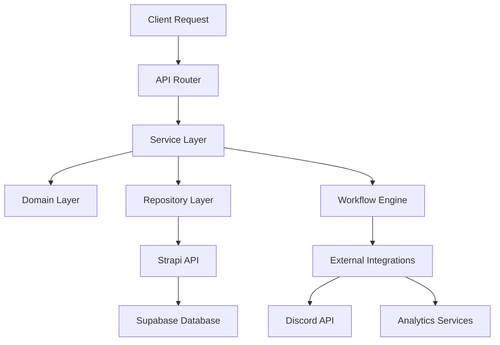

# Unified Business Logic API Implementation Strategy

## Executive Summary

This document outlines the strategy for implementing the unified business logic API architecture within the existing Virion Labs mono-repo. We will transform the existing `/packages/api/` package by directly migrating from Supabase to Strapi and enhancing it into a sophisticated business logic orchestration layer.

**Key Context:**
- Strapi is already fully implemented and running at localhost:1337
- Dashboard and Discord bot connect directly to Supabase (not through API package)
- Only the MCP server currently uses the API package
- This allows for direct Strapi migration without disrupting other services

---

## Current State Analysis

### Existing API Package Strengths
- **Architecture**: Well-structured FastAPI application with proper separation of concerns
- **Coverage**: 15 router modules covering all major business domains
- **Limited Integration Impact**: Only MCP server currently uses this API package
- **Authentication**: Robust dual-auth system (JWT + API keys)
- **Patterns**: Following FastAPI best practices with service layers

### Current Limitations
- **Data Layer Coupling**: Direct Supabase queries throughout service methods
- **Limited Domain Logic**: Business rules scattered across services
- **No Workflow Management**: Complex multi-step processes handled ad-hoc
- **Outdated Database**: Using Supabase while Strapi is available and preferred

---

## Implementation Strategy

### Core Philosophy: **Direct Strapi Migration with Business Logic Enhancement**

Since Strapi is already implemented and only the MCP server uses the current API package, we can migrate directly to Strapi while enhancing the business logic architecture. This eliminates the need for gradual migration strategies.

### Simplified Two-Phase Approach

#### **Phase 1: Direct Strapi Migration with Business Logic Enhancement**
**Objective**: Replace Supabase with Strapi while extracting and organizing business logic

**Current Pattern:**
```python
# In campaign_service.py
async def create_campaign(self, user_id: UUID, data: CampaignCreate):
    # Mixed: validation + business logic + database access
    if not self._validate_campaign_data(data):
        raise HTTPException(400, "Invalid campaign data")
    
    campaign_dict = data.model_dump()
    campaign_dict["client_id"] = user_id
    
    response = await self.strapi.post("/api/campaigns", campaign_dict)
    return self._process_response(response)
```

**Enhanced Pattern:**
```python
# New domain layer
class CampaignDomain:
    def create_campaign(self, data: CampaignCreate, client_id: UUID) -> CampaignBusinessModel:
        # Pure business logic - no database access
        validated_campaign = self._apply_business_rules(data)
        enriched_campaign = self._enrich_campaign_data(validated_campaign, client_id)
        return self._create_campaign_model(enriched_campaign)

# Enhanced service layer
async def create_campaign(self, user_id: UUID, data: CampaignCreate):
    # Service orchestrates domain logic + data access
    domain = CampaignDomain()
    business_campaign = domain.create_campaign(data, user_id)
    
    # Data access through Strapi client
    saved_campaign = await self.strapi_client.save_campaign(business_campaign)
    
    # Business workflow triggers
    await self._trigger_campaign_creation_workflow(saved_campaign)
    
    return saved_campaign
```

#### **Phase 2: Advanced Business Logic & Workflow Implementation**
**Objective**: Implement sophisticated business workflow management and domain logic

**Strapi Client Integration:**
```python
# Direct Strapi integration
class StrapiClient:
    def __init__(self, base_url: str, api_token: str):
        self.base_url = base_url
        self.api_token = api_token
        self.session = aiohttp.ClientSession()
    
    async def post(self, endpoint: str, data: dict) -> dict:
        # Handle Strapi API calls with authentication
        headers = {"Authorization": f"Bearer {self.api_token}"}
        async with self.session.post(f"{self.base_url}{endpoint}", 
                                   json=data, headers=headers) as response:
            return await response.json()
    
    async def get(self, endpoint: str, params: dict = None) -> dict:
        # Handle Strapi API calls with query parameters
        headers = {"Authorization": f"Bearer {self.api_token}"}
        async with self.session.get(f"{self.base_url}{endpoint}", 
                                  params=params, headers=headers) as response:
            return await response.json()
```

#### **Advanced Workflow Engine Implementation**
**Objective**: Implement sophisticated business workflow management

**Workflow Architecture:**
```python
class BusinessWorkflow:
    def __init__(self, name: str):
        self.name = name
        self.steps = []
        self.context = {}
    
    def add_step(self, step: WorkflowStep) -> 'BusinessWorkflow':
        self.steps.append(step)
        return self
    
    async def execute(self, context: dict) -> WorkflowResult:
        # Execute workflow steps with error handling and rollback

# Example: Campaign Creation Workflow
class CampaignCreationWorkflow(BusinessWorkflow):
    def __init__(self):
        super().__init__("campaign_creation")
        self.add_step(ValidateCampaignDataStep())
        self.add_step(CreateCampaignStep())
        self.add_step(SetupDiscordBotStep())
        self.add_step(NotifyInfluencersStep())
        self.add_step(CreateAnalyticsTrackingStep())
```

---

## Detailed Implementation Plan

### **Phase 1: Direct Strapi Migration with Business Logic Enhancement (Weeks 1-2)**

#### 1.1 Create Domain Layer Structure
```
packages/api/
├── domain/                 # New domain layer
│   ├── __init__.py
│   ├── campaigns/
│   │   ├── __init__.py
│   │   ├── models.py       # Business models
│   │   ├── rules.py        # Business rules
│   │   └── domain.py       # Domain logic
│   ├── referrals/
│   ├── analytics/
│   └── user_management/
```

#### 1.2 Replace Supabase with Strapi Client
- Update all services to use Strapi client instead of Supabase
- Configure Strapi authentication and connection
- Update data models to match Strapi content types
- Test MCP server integration with new Strapi backend

#### 1.3 Extract Business Logic by Domain
- **Campaign Domain**: Campaign creation, validation, lifecycle management
- **Referral Domain**: Link generation, tracking, commission calculation
- **Analytics Domain**: Metrics calculation, report generation
- **User Management Domain**: Onboarding, role assignment, permissions

#### 1.4 Maintain Service Layer as Orchestrators
- Services become thin orchestration layers using Strapi client
- Handle cross-domain coordination
- Manage transaction boundaries
- Coordinate with external systems

### **Phase 2: Advanced Business Logic & Workflow Implementation (Weeks 3-4)**

#### 2.1 Implement Business Logic Endpoints
```python
# New business logic focused endpoints
@router.post("/api/v1/workflows/campaign-creation/complete")
async def complete_campaign_creation(data: CampaignCreationWorkflow):
    # Multi-step business process
    domain = CampaignDomain()
    workflow = CampaignCreationWorkflow()
    result = await workflow.execute(data)
    return result

@router.post("/api/v1/operations/campaign/deploy")
async def deploy_campaign(campaign_id: UUID, config: DeploymentConfig):
    # Complex business operation
    deployment = CampaignDeploymentOperation()
    result = await deployment.execute(campaign_id, config)
    return result
```

#### 2.2 Implement Strapi Data Layer
- Direct Strapi API integration throughout services
- Strapi content type mapping
- Error handling and retry logic for Strapi calls
- Caching strategies for frequently accessed data

#### 2.3 Testing & Validation
- Comprehensive testing with Strapi backend
- MCP server integration testing
- Performance benchmarking against previous Supabase implementation

### **Integration & Optimization (Weeks 5-6)**

#### Advanced Workflow Infrastructure
```python
class WorkflowEngine:
    def __init__(self):
        self.workflows = {}
        self.step_registry = StepRegistry()
    
    async def execute_workflow(self, workflow_name: str, context: dict) -> WorkflowResult:
        workflow = self.workflows[workflow_name]
        return await workflow.execute(context)

class WorkflowStep(ABC):
    @abstractmethod
    async def execute(self, context: dict) -> StepResult:
        pass
    
    @abstractmethod
    async def rollback(self, context: dict) -> None:
        pass
```

#### Business Workflow Implementations
- **Onboarding Workflows**: User registration → Discord role assignment → Campaign access
- **Campaign Deployment**: Creation → Bot setup → Influencer notification → Analytics setup  
- **Referral Processing**: Link generation → Tracking setup → Commission calculation
- **Analytics Generation**: Data collection → Processing → Report generation
- **Integration Testing**: Comprehensive MCP server integration validation
- **Performance Optimization**: Response time improvements and caching

---

## API Endpoint Transformation Strategy

### Current Structure → Business Logic Structure

#### **Before (Current Mixed Pattern):**
```
GET  /campaigns/                    # List campaigns
POST /campaigns/                    # Create campaign
GET  /campaigns/{id}                # Get campaign
PUT  /campaigns/{id}                # Update campaign
```

#### **After (Business Logic Focused):**
```
# Workflows - Multi-step business processes
POST /api/v1/workflows/campaign-creation/start        # Start campaign creation workflow
POST /api/v1/workflows/campaign-creation/complete     # Complete campaign setup
POST /api/v1/workflows/onboarding/initiate           # Start user onboarding
POST /api/v1/workflows/referral-processing/generate   # Generate referral links

# Operations - Complex business operations
POST /api/v1/operations/campaign/deploy               # Deploy campaign with bot setup
GET  /api/v1/operations/analytics/generate-report     # Generate business reports
POST /api/v1/operations/referral/calculate-roi        # Calculate referral ROI

# Integrations - External system coordination
POST /api/v1/integrations/discord/server-setup       # Discord bot deployment
POST /api/v1/integrations/strapi/sync-permissions     # Sync user permissions
POST /api/v1/integrations/analytics/track-event       # Track business events
```

### MCP Server Integration Strategy
- Maintain existing endpoint interfaces for MCP server compatibility
- Ensure no breaking changes to current API contracts
- Test all MCP server use cases with new Strapi backend
- Provide clear migration documentation for any necessary MCP server updates

---

## Technical Implementation Details

### **Data Flow Architecture**



### **Error Handling Strategy**
- **Domain Errors**: Business rule violations, validation failures
- **Infrastructure Errors**: Database connectivity, external service failures
- **Workflow Errors**: Step failures, rollback scenarios
- **Integration Errors**: External API failures, rate limiting

### **Testing Strategy**
- **Unit Tests**: Domain logic, business rules
- **Integration Tests**: Repository implementations, external APIs
- **Workflow Tests**: End-to-end business process testing
- **Performance Tests**: High-load scenarios, response times

### **Monitoring & Observability**
- **Business Metrics**: Workflow completion rates, business KPIs
- **Technical Metrics**: Response times, error rates, resource usage
- **Domain Events**: Business event tracking and analytics
- **Audit Logging**: Business operation tracking for compliance

---

## Migration Timeline

### **Week 1-2: Direct Strapi Migration with Business Logic Enhancement**
- Replace all Supabase calls with Strapi client calls
- Create domain layer structure
- Extract campaign, referral, analytics, and user management domain logic
- Update services to use domain objects and Strapi client
- Test MCP server integration with new backend

### **Week 3-4: Advanced Business Logic & Workflow Implementation**
- Implement new business logic focused endpoints (workflows, operations, integrations)
- Build core workflow infrastructure
- Implement sophisticated business workflows
- Add comprehensive error handling and monitoring
- Performance optimization and caching

### **Week 5-6: Integration, Testing & Documentation**
- Comprehensive end-to-end testing
- MCP server integration validation
- Performance benchmarking
- Security review
- Documentation updates
- Production deployment preparation

---

## Risk Mitigation

### **Technical Risks**
- **Data Consistency**: Comprehensive testing with Strapi backend
- **Performance Impact**: Monitor response times during migration
- **MCP Server Integration**: Ensure no breaking changes to existing API contracts

### **Business Risks**
- **Service Disruption**: Thorough testing before deployment
- **Data Migration**: Validate Strapi data integrity
- **Limited Impact**: Only MCP server affected (minimal risk)

### **Mitigation Strategies**
- Comprehensive test coverage for all endpoints
- MCP server integration testing throughout development
- Performance monitoring and optimization
- Quick rollback capability to Supabase if needed

---

## Success Metrics

### **Technical Metrics**
- API response time improvements
- Code maintainability scores
- Test coverage percentages
- Error rate reductions

### **Business Metrics**
- Workflow completion rates
- Business operation efficiency
- Integration reliability
- Developer productivity improvements

### **Quality Metrics**
- Code complexity reduction
- Business logic clarity
- Domain model completeness
- Architecture compliance

---

This strategy transforms your existing API into a sophisticated business logic orchestration platform while leveraging the already-implemented Strapi backend. The direct migration approach is possible due to the limited integration scope (only MCP server) and ensures faster delivery with minimal disruption.