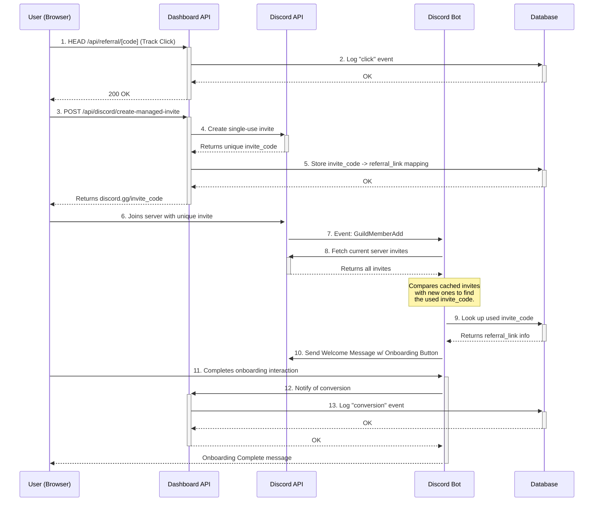

# Complete Referral Link Tracking System

This document describes the comprehensive end-to-end referral link tracking system that connects web-based referral links to Discord server onboarding and conversion tracking.

## System Overview

The referral tracking system provides a complete user journey from initial click to final conversion:

1. **Landing Page Click** - User clicks referral link on social media/web
2. **Campaign Landing Page** - User views branded campaign page with offer details
3. **Discord Invite Creation** - System generates unique, tracked Discord invite
4. **Discord Server Join** - User joins server via tracked invite
5. **Invite Attribution** - Bot identifies which referral link was used
6. **Welcome & Onboarding** - Bot sends welcome message with onboarding button
7. **Conversion Tracking** - User completes onboarding, conversion is recorded

## Architecture Components

### 1. Web Dashboard (Next.js)
- Landing page rendering (`/r/[code]`)
- Referral link management
- Analytics dashboard
- Campaign configuration

### 2. Discord Bot (Node.js)
- Invite cache management
- New member detection
- Onboarding flow management
- Conversion tracking

### 3. Database (Supabase)
- Referral links storage
- Discord invite tracking
- Analytics data
- Campaign configuration

## Database Schema

### Core Tables

#### `referral_links`
Stores the main referral link data:
```sql
CREATE TABLE referral_links (
  id UUID PRIMARY KEY,
  influencer_id UUID REFERENCES auth.users(id),
  campaign_id UUID REFERENCES discord_guild_campaigns(id),
  title TEXT NOT NULL,
  description TEXT,
  platform TEXT NOT NULL,
  referral_code TEXT UNIQUE NOT NULL,
  referral_url TEXT NOT NULL,
  discord_invite_url TEXT,
  clicks INTEGER DEFAULT 0,
  conversions INTEGER DEFAULT 0,
  is_active BOOLEAN DEFAULT true,
  expires_at TIMESTAMP,
  created_at TIMESTAMP DEFAULT NOW(),
  updated_at TIMESTAMP DEFAULT NOW()
);
```

#### `discord_invite_links`
Links Discord invites to referral codes:
```sql
CREATE TABLE discord_invite_links (
  id UUID PRIMARY KEY,
  campaign_id UUID REFERENCES discord_guild_campaigns(id),
  referral_link_id UUID REFERENCES referral_links(id),
  discord_invite_code TEXT UNIQUE NOT NULL,
  discord_invite_url TEXT NOT NULL,
  guild_id TEXT NOT NULL,
  channel_id TEXT NOT NULL,
  max_uses INTEGER DEFAULT 1,
  created_at TIMESTAMP DEFAULT NOW()
);
```

#### `referral_analytics`
Tracks all referral events:
```sql
CREATE TABLE referral_analytics (
  id UUID PRIMARY KEY,
  link_id UUID REFERENCES referral_links(id),
  event_type TEXT NOT NULL, -- 'click', 'discord_join', 'conversion'
  user_agent TEXT,
  ip_address INET,
  referrer TEXT,
  device_type TEXT,
  browser TEXT,
  discord_user_id TEXT,
  conversion_value DECIMAL DEFAULT 0,
  metadata JSONB,
  created_at TIMESTAMP DEFAULT NOW()
);
```

## End-to-End Flow Documentation

### Sequence Diagram

The following diagram illustrates the complete end-to-end flow from referral link click to conversion tracking:



### Step 1: Landing Page Click Tracking

**Location**: `virion-labs-dashboard/app/r/[code]/page.tsx`

When a user clicks a referral link:

```typescript
// 1. Page loads and extracts referral code from URL
const params = useParams()
const referralCode = params.code

// 2. Track the click immediately
const trackClick = async () => {
  try {
    await fetch(`/api/referral/${referralCode}`, { method: 'HEAD' })
  } catch (error) {
    console.error('Failed to track click:', error)
  }
}

// 3. Load campaign data for display
const fetchCampaignData = async () => {
  const response = await fetch(`/api/referral/${referralCode}/campaign`)
  const data = await response.json()
  setData(data)
}
```

**Backend**: `virion-labs-dashboard/app/api/referral/[code]/route.ts`

```typescript
export async function HEAD(request: NextRequest, { params }: { params: Promise<{ code: string }> }) {
  const { code } = await params
  
  // Find referral link
  const { data: link } = await supabase
    .from('referral_links')
    .select('*')
    .eq('referral_code', code)
    .eq('is_active', true)
    .single()

  // Record click analytics
  await supabase.from('referral_analytics').insert([{
    link_id: link.id,
    event_type: 'click',
    user_agent: request.headers.get('user-agent'),
    ip_address: request.headers.get('x-forwarded-for'),
    // ... other tracking data
  }])

  // Update click count
  await supabase
    .from('referral_links')
    .update({ clicks: link.clicks + 1 })
    .eq('id', link.id)
}
```

### Step 2: Managed Discord Invite Creation

**Location**: `virion-labs-dashboard/components/campaign-referral-landing-page.tsx`

When user clicks "Join Discord Server":

```typescript
const handleJoinDiscord = async () => {
  try {
    // Create unique, tracked Discord invite
    const response = await fetch('/api/discord/create-managed-invite', {
      method: 'POST',
      headers: { 'Content-Type': 'application/json' },
      body: JSON.stringify({ referral_code: referralCode }),
    });

    const result = await response.json();
    
    if (result.invite_url) {
      // Redirect to unique Discord invite
      window.location.href = result.invite_url;
    }
  } catch (error) {
    console.error('Error creating managed invite:', error);
  }
};
```

**Backend**: `virion-labs-dashboard/app/api/discord/create-managed-invite/route.ts`

```typescript
export async function POST(request: NextRequest) {
  const { referral_code } = await request.json();

  // 1. Find referral link and campaign
  const { data: linkData } = await supabase
    .from('referral_links')
    .select(`
      id,
      campaign:discord_guild_campaigns!referral_links_campaign_id_fkey(
        id, guild_id, channel_id
      )
    `)
    .eq('referral_code', referral_code)
    .single();

  // 2. Create single-use Discord invite via Discord API
  const discordResponse = await fetch(
    `https://discord.com/api/v10/channels/${campaign.channel_id}/invites`,
    {
      method: 'POST',
      headers: {
        'Authorization': `Bot ${DISCORD_BOT_TOKEN}`,
        'Content-Type': 'application/json',
      },
      body: JSON.stringify({
        max_age: 600,    // 10 minutes
        max_uses: 1,     // Single use
        unique: true     // Prevent duplicates
      }),
    }
  );

  const invite = await discordResponse.json();

  // 3. Store invite-to-referral mapping
  await supabase.from('discord_invite_links').insert({
    campaign_id: campaign.id,
    referral_link_id: linkData.id,
    discord_invite_code: invite.code,
    discord_invite_url: `https://discord.gg/${invite.code}`,
    guild_id: campaign.guild_id,
    channel_id: campaign.channel_id,
    max_uses: 1,
  });

  return NextResponse.json({
    success: true,
    invite_url: `https://discord.gg/${invite.code}`,
  });
}
```

### Step 3: Discord Bot Invite Detection

**Location**: `virion-labs-discord-bot/src/core/BotClient.js`

The bot maintains a cache of invite usage counts:

```javascript
// On startup and when joining new servers
async cacheGuildInvites(guild) {
  const invites = await guild.invites.fetch();
  
  // Create immutable snapshots to prevent reference issues
  const inviteSnapshots = new Map();
  for (const [code, invite] of invites) {
    inviteSnapshots.set(code, {
      code: invite.code,
      uses: invite.uses,
      maxUses: invite.maxUses,
      // ... other properties
    });
  }
  
  this.invitesCache.set(guild.id, inviteSnapshots);
}

// Event listener for new members
this.client.on(Events.GuildMemberAdd, (member) => {
  if (this.onboardingHandler) {
    this.onboardingHandler.handleGuildMemberAdd(member);
  }
});
```

**Location**: `virion-labs-discord-bot/src/handlers/OnboardingHandler.js`

When a new member joins:

```javascript
async handleGuildMemberAdd(member) {
  // 1. Determine which invite was used
  const usedInvite = await this.findUsedInvite(member.guild);
  
  if (!usedInvite) {
    this.logger.warn(`Could not determine invite used by ${member.user.tag}`);
    return;
  }

  // 2. Check if it's a managed (tracked) invite
  const { data: managedInvite } = await this.campaignService.getManagedInvite(usedInvite.code);
  
  if (managedInvite) {
    // 3. Get campaign details
    const campaign = await this.campaignService.getCampaignById(managedInvite.campaign_id);
    
    // 4. Send welcome message with onboarding button
    const welcomeMessage = `Welcome, ${member.user.toString()}! You've been invited via a special link for the **${campaign.campaign_name}** campaign. Click the button below to get started!`;
    
    const startButton = new ButtonBuilder()
      .setCustomId(`start_onboarding_${campaign.id}_${member.id}_${managedInvite.referral_code}`)
      .setLabel('🚀 Start Onboarding')
      .setStyle(ButtonStyle.Success);

    // 5. Find appropriate channel and send message
    const channel = this.findWelcomeChannel(member.guild);
    if (channel) {
      await channel.send({ 
        content: welcomeMessage, 
        components: [new ActionRowBuilder().addComponents(startButton)] 
      });
    }
  }
}
```

### Step 4: Invite Usage Detection Algorithm

**Location**: `virion-labs-discord-bot/src/handlers/OnboardingHandler.js`

```javascript
async findUsedInvite(guild) {
  // 1. Get cached "before" state
  const oldInvites = this.invitesCache.get(guild.id);
  
  // 2. Fetch current "after" state
  const newInvites = await guild.invites.fetch();
  
  let usedInvite = null;

  // 3. Compare usage counts to find increased usage
  for (const [inviteCode, newInvite] of newInvites) {
    const oldInvite = oldInvites.get(inviteCode);
    
    if (oldInvite && newInvite.uses > oldInvite.uses) {
      usedInvite = newInvite;
      break;
    }
  }

  // 4. Check for disappeared single-use invites
  if (!usedInvite) {
    const disappearedInvite = oldInvites.find(oldInv => 
      !newInvites.has(oldInv.code) && oldInv.maxUses === 1
    );
    if (disappearedInvite) {
      usedInvite = disappearedInvite;
    }
  }

  // 5. Update cache only after successful detection
  if (usedInvite) {
    // Create new immutable snapshots for cache
    const newSnapshots = new Map();
    for (const [code, invite] of newInvites) {
      newSnapshots.set(code, {
        code: invite.code,
        uses: invite.uses,
        maxUses: invite.maxUses,
        // ... other properties
      });
    }
    this.invitesCache.set(guild.id, newSnapshots);
  }

  return usedInvite;
}
```

### Step 5: Onboarding and Conversion Tracking

When user clicks the onboarding button:

```javascript
async handleStartButton(interaction) {
  // 1. Extract referral code from button custom ID
  const customIdParts = interaction.customId.split('_');
  const campaignId = customIdParts[2];
  const userId = customIdParts[3];
  const referralCode = customIdParts[4];

  // 2. Get campaign and create onboarding session
  const campaign = await this.campaignService.getCampaignById(campaignId);
  const session = await this.getOrCreateSession(campaignId, userId, userInfo.tag, referralCode);

  // 3. Show onboarding modal or complete immediately
  if (session.fields && session.fields.length > 0) {
    await this.showOnboardingModal(interaction, campaign, session);
  } else {
    await this.completeOnboarding(interaction, campaign);
  }
}

async completeOnboarding(interaction, campaign) {
  // 1. Get referral code from session
  const sessionKey = `${campaign.id}:${userInfo.id}`;
  const modalSession = this.modalSessions.get(sessionKey);
  const referralCode = modalSession?.referral_code || null;

  // 2. Track conversion
  await this.analyticsService.trackOnboardingCompletion(
    campaign.id, 
    guildInfo.id, 
    userInfo.id, 
    userInfo.tag,
    referralCode  // This links back to the original referral
  );

  // 3. Assign roles if configured
  if (campaign.auto_role_assignment && campaign.target_role_ids) {
    await this.assignRoles(interaction, campaign.target_role_ids);
  }
}
```

## Key Features

### 1. Invite Cache Management

**Problem Solved**: Discord doesn't tell us which invite a user used when they join.

**Solution**: 
- Cache invite usage counts before user joins
- Compare with fresh counts after user joins
- Detect which invite had increased usage
- Handle single-use invites that disappear after use

**Critical Implementation Details**:
- Create immutable snapshots to prevent reference mutation
- Only update cache after successful invite detection
- Handle bot restarts and new server joins
- Provide detailed debugging logs

### 2. Referral Attribution Chain

**The Complete Chain**:
1. `referral_code` → `referral_links.id`
2. `referral_links.id` → `discord_invite_links.referral_link_id`
3. `discord_invite_links.discord_invite_code` → Used Discord invite
4. Discord invite → New Discord member
5. Discord member → Onboarding completion
6. Onboarding completion → Conversion tracking with original `referral_code`

### 3. Channel Fallback System

**Problem**: Not all Discord servers have a system channel configured.

**Solution**: Progressive fallback strategy:
```javascript
findWelcomeChannel(guild) {
  // 1. Try system channel first
  let channel = guild.systemChannel;
  
  if (!channel) {
    // 2. Look for common welcome channel names
    channel = guild.channels.cache.find(ch => 
      ch.type === 0 && 
      (ch.name.includes('general') || ch.name.includes('welcome')) &&
      ch.permissionsFor(guild.members.me).has(['SendMessages'])
    );
  }
  
  if (!channel) {
    // 3. Use any text channel with send permissions
    channel = guild.channels.cache.find(ch => 
      ch.type === 0 && 
      ch.permissionsFor(guild.members.me).has(['SendMessages'])
    );
  }
  
  return channel;
}
```

## Troubleshooting

### Common Issues

#### 1. "No old invites found in cache"
**Cause**: Bot restarted or joined new server without caching invites.
**Solution**: Restart bot to trigger invite caching on startup.

#### 2. "Could not determine which invite was used"
**Causes**: 
- Cache was corrupted by object reference mutation
- Multiple users joined simultaneously
- Bot lacks permissions to fetch invites

**Solutions**:
- Ensure immutable snapshots in cache
- Add rate limiting for simultaneous joins
- Verify bot permissions

#### 3. "Welcome message not sent"
**Cause**: No suitable channel found or missing permissions.
**Solution**: Configure system channel or ensure bot has send message permissions.

#### 4. "Referral not attributed"
**Cause**: Discord invite not found in `discord_invite_links` table.
**Solution**: Verify managed invite creation process and database records.

This documentation provides a complete understanding of the referral tracking system, from initial implementation to troubleshooting and future enhancements. The system is designed to be robust, scalable, and maintainable while providing accurate attribution of referrals from web clicks to Discord conversions.

## API Endpoints

### Landing Page APIs

#### `GET /api/referral/[code]/campaign`
Returns campaign data for landing page display.

#### `HEAD /api/referral/[code]`
Tracks referral link clicks without redirecting.

### Discord Integration APIs

#### `POST /api/discord/create-managed-invite`
Creates tracked Discord invite linked to referral code.

**Request**:
```json
{
  "referral_code": "summer-campaign-abc123"
}
```

**Response**:
```json
{
  "success": true,
  "invite_url": "https://discord.gg/UniqueCode123"
}
```

#### `POST /api/discord-bot/onboarding`
Creates onboarding session with referral tracking.

**Request**:
```json
{
  "campaign_id": "uuid",
  "discord_user_id": "discord_user_id",
  "discord_username": "username#1234",
  "referral_code": "summer-campaign-abc123"
}
```

## Analytics and Tracking

### Event Types Tracked

1. **`click`** - Initial referral link click
2. **`discord_join`** - User joins Discord server
3. **`onboarding_start`** - User begins onboarding process
4. **`conversion`** - User completes onboarding

### Analytics Data Structure

```json
{
  "link_id": "uuid",
  "event_type": "conversion",
  "user_agent": "Mozilla/5.0...",
  "ip_address": "192.168.1.100",
  "device_type": "desktop",
  "browser": "Chrome",
  "discord_user_id": "user#1234",
  "conversion_value": 25.99,
  "metadata": {
    "campaign_id": "uuid",
    "referral_code": "summer-campaign-abc123",
    "onboarding_fields_completed": 5,
    "roles_assigned": ["Member", "Campaign Participant"]
  }
}
```

## Configuration and Setup

### Environment Variables

**Dashboard (.env)**:
```bash
NEXT_PUBLIC_SUPABASE_URL=your_supabase_url
SUPABASE_SERVICE_ROLE_KEY=your_service_role_key
DISCORD_BOT_TOKEN=your_bot_token
```

**Discord Bot (.env)**:
```bash
DISCORD_BOT_TOKEN=your_bot_token
DASHBOARD_API_URL=https://your-dashboard.com
```

### Required Discord Permissions

The bot needs these permissions:
- `View Channels`
- `Send Messages`
- `Manage Roles` (for role assignment)
- `Create Instant Invite`
- `Manage Guild` (to fetch invites)

### Database Setup

Run migrations in order:
1. Create referral_links table
2. Create discord_invite_links table  
3. Create referral_analytics table
4. Set up Row Level Security (RLS) policies

## Troubleshooting

### Common Issues

#### 1. "No old invites found in cache"
**Cause**: Bot restarted or joined new server without caching invites.
**Solution**: Restart bot to trigger invite caching on startup.

#### 2. "Could not determine which invite was used"
**Causes**: 
- Cache was corrupted by object reference mutation
- Multiple users joined simultaneously
- Bot lacks permissions to fetch invites

**Solutions**:
- Ensure immutable snapshots in cache
- Add rate limiting for simultaneous joins
- Verify bot permissions

#### 3. "Welcome message not sent"
**Cause**: No suitable channel found or missing permissions.
**Solution**: Configure system channel or ensure bot has send message permissions.

#### 4. "Referral not attributed"
**Cause**: Discord invite not found in `discord_invite_links` table.
**Solution**: Verify managed invite creation process and database records.

### Debug Mode

Enable detailed logging:

**Bot**:
```javascript
// Set log level to debug
this.logger.setLevel('debug');

// Enable invite debugging
const INVITE_DEBUG = process.env.INVITE_DEBUG === 'true';
```

**Dashboard**:
```bash
DEBUG_REFERRALS=true
LOG_LEVEL=debug
```

### Monitoring Queries

**Check referral attribution chain**:
```sql
SELECT 
  rl.referral_code,
  rl.title,
  dil.discord_invite_code,
  ra.event_type,
  ra.discord_user_id,
  ra.created_at
FROM referral_links rl
JOIN discord_invite_links dil ON rl.id = dil.referral_link_id
LEFT JOIN referral_analytics ra ON rl.id = ra.link_id
WHERE rl.referral_code = 'your-referral-code'
ORDER BY ra.created_at;
```

**Check invite cache status**:
```sql
SELECT 
  guild_id,
  COUNT(*) as invite_count,
  MAX(created_at) as latest_invite
FROM discord_invite_links 
GROUP BY guild_id;
```

## Performance Considerations

### Bot Performance
- Invite cache stored in memory for fast access
- Immutable snapshots prevent reference issues
- Efficient Map-based lookups
- Minimal Discord API calls

### Database Performance
- Proper indexing on frequently queried columns
- Efficient joins between related tables
- JSONB for flexible metadata storage
- Partitioning for large analytics tables

### Scalability
- Stateless bot design allows horizontal scaling
- Database handles concurrent operations
- Rate limiting prevents API abuse
- Graceful error handling and retries

## Security Considerations

### Data Protection
- User IP addresses and user agents stored securely
- Discord user IDs are non-sensitive public identifiers
- Referral codes are non-guessable UUIDs
- All database operations use RLS policies

### Bot Security
- Bot token stored securely
- Limited Discord permissions
- Input validation on all endpoints
- Protection against injection attacks

### API Security
- Authentication required for sensitive operations
- Rate limiting on public endpoints
- CORS properly configured
- Request validation with schemas

## Future Enhancements

### Planned Features
1. **Multi-Server Support**: Track referrals across multiple Discord servers
2. **Advanced Analytics**: Cohort analysis, funnel visualization
3. **A/B Testing**: Multiple landing page variants
4. **Webhook Integration**: Real-time notifications for conversions
5. **Custom Domains**: Branded short URLs
6. **Bulk Operations**: Mass import/export of referral data

### Technical Improvements
1. **Redis Caching**: Distributed cache for invite data
2. **Message Queues**: Asynchronous processing of events
3. **GraphQL API**: More efficient data fetching
4. **Real-time Updates**: WebSocket connections for live data
5. **Advanced Monitoring**: Comprehensive observability stack

This documentation provides a complete understanding of the referral tracking system, from initial implementation to troubleshooting and future enhancements. The system is designed to be robust, scalable, and maintainable while providing accurate attribution of referrals from web clicks to Discord conversions. 