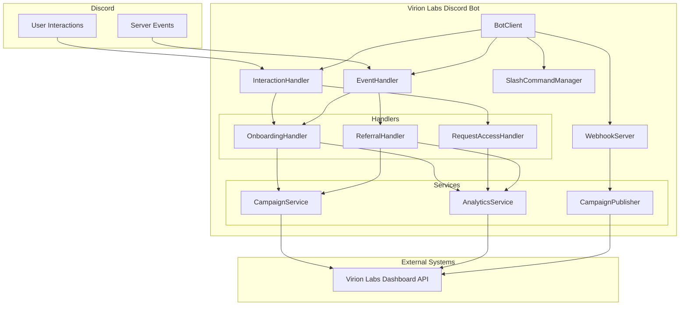

# Virion Labs Discord Bot: Functionality Analysis

## 1. Overview

The Virion Labs Discord Bot is a sophisticated application designed to manage user onboarding, campaign participation, and access control within a Discord server. It seamlessly integrates with the Virion Labs dashboard to provide a rich, interactive experience for users, while also providing valuable analytics and automation for server administrators.

## 2. Architecture

The bot is built with a modular architecture that separates concerns into distinct components. This design makes the bot scalable, maintainable, and easy to extend.

### Core Components

*   **`BotClient`**: The central orchestrator of the bot. It initializes the Discord client, manages event listeners, and coordinates all other components.
*   **`InteractionHandler`**: Routes all user interactions (slash commands, buttons, modals) to the appropriate handlers, acting as the primary entry point for user-initiated actions.
*   **`EventHandler`**: Handles non-interactive Discord events, such as new members joining the server, and directs them to the relevant business logic.
*   **`SlashCommandManager`**: Defines and builds the slash commands that are registered with Discord, providing the user-facing command structure.
*   **`WebhookServer`**: An Express.js server that listens for incoming webhooks from the dashboard, enabling real-time updates and actions, such as publishing new campaigns.

### Architecture Diagram

## 3. Functionalities

The bot provides several key functionalities to manage the user lifecycle and campaign engagement.

### 3.1. Campaign Onboarding (`/join`)

This is the primary feature of the bot, allowing users to discover and join campaigns.

*   **Command**: `/join`
*   **Description**: When a user executes the `/join` command, the bot intelligently displays a list of active campaigns. The campaigns shown are context-aware:
    *   In a designated "join-campaigns" channel, it shows all public campaigns.
    *   In a private or campaign-specific channel, it shows only the campaigns associated with that channel.
*   **Workflow**:
    1.  **`JoinCommand`**: Handles the initial `/join` command, fetches active campaigns from the `CampaignService`, and displays them to the user with buttons to start onboarding.
    2.  **`OnboardingHandler`**: Manages the entire onboarding process. When a user clicks a campaign button, this handler:
        *   Fetches the campaign-specific questions from the `CampaignService`.
        *   Displays a modal with the questions.
        *   Validates user responses.
        *   Saves the responses to the dashboard via the `CampaignService`.
        *   Assigns roles to the user upon successful completion.
    3.  **`CampaignService`**: Acts as the intermediary between the bot and the dashboard API, fetching campaign data and saving user responses.
    4.  **`AnalyticsService`**: Tracks the start and completion of the onboarding process.

### 3.2. Access Request (`/request-access`)

This functionality allows new users to gain access to private channels by verifying their identity.

*   **Command**: `/request-access`
*   **Description**: This command initiates a workflow for users to request access to protected channels. It is typically used in a specific "request-access" channel.
*   **Workflow**:
    1.  **`RequestAccessCommand`**: Handles the `/request-access` command and presents the user with a button to start the process.
    2.  **`RequestAccessHandler`**: When the user clicks the button, this handler:
        *   Displays a modal asking for the user's full name and email address.
        *   Validates the submitted information.
        *   Assigns a "Verified" role to the user, granting them access to private channels.
        *   Stores the user's information in the dashboard database via an API call.
    3.  **`AnalyticsService`**: Tracks the completion of the access request.

### 3.3. Referral System

The bot includes a referral system to track how users are invited to the server and to associate them with specific campaigns.

*   **Description**: The referral system works in two primary ways:
    1.  **Managed Invite Links**: When a user joins the server using a special invite link generated by the dashboard, the bot automatically detects this.
    2.  **Referral Codes in Messages**: The bot can also detect referral codes shared in messages.
*   **Workflow**:
    1.  **`OnboardingHandler` (`handleGuildMemberAdd`)**: When a new member joins, this handler checks the invite used. If it's a managed invite, it retrieves the referral context from the `CampaignService` and can trigger a specific onboarding flow.
    2.  **`ReferralHandler`**: This handler is responsible for validating referral codes found in messages. It communicates with the `CampaignService` to verify the code and provides feedback to the user.
    3.  **`CampaignService`**: Provides endpoints for validating referral codes and retrieving managed invite link context.
    4.  **`AnalyticsService`**: Tracks referral conversions, providing valuable data on influencer and campaign performance.

## 4. Webhook Integration

The `WebhookServer` allows the Virion Labs dashboard to communicate with the bot in real-time, enabling a dynamic and responsive system.

*   **`/api/publish-campaigns`**: This is the primary webhook endpoint. When campaigns are created or updated in the dashboard, it can trigger this webhook to have the bot instantly publish or update the campaign messages in the designated Discord channels.
*   **`/api/cache-invalidation`**: This endpoint allows the dashboard to invalidate the bot's internal cache, ensuring that any changes to campaign configurations are immediately reflected in the bot's behavior.

This webhook-driven approach ensures that the bot always has the most up-to-date campaign information without requiring frequent polling or manual intervention.