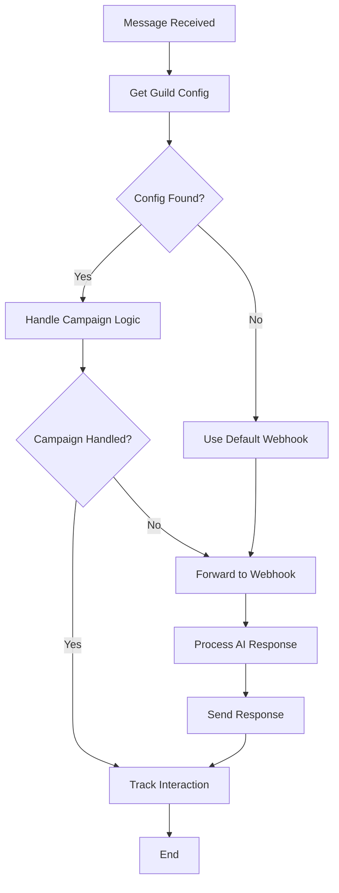

# Discord Bot Integration with Virion Labs Dashboard

## Overview

This document outlines the comprehensive integration approach for connecting the Discord bot with the Virion Labs dashboard to support client campaigns and influencer referrals. The integration enables dynamic bot behavior based on campaign configurations, referral tracking, and client-specific customization.

## Architecture

### Current vs Enhanced Architecture

**Before Integration:**
- Discord bot forwards all messages to a static n8n webhook
- No campaign-specific behavior
- No referral tracking integration
- No client customization

**After Integration:**
- Discord bot queries dashboard for guild/channel-specific configurations
- Campaign-specific bot behavior and responses
- Automatic referral code detection and tracking
- Client branding and customization
- Comprehensive analytics and interaction tracking

## Database Schema

### New Tables

#### 1. `discord_guild_campaigns`
Tracks Discord server campaigns tied to clients and referral links.

```sql
CREATE TABLE discord_guild_campaigns (
    id UUID PRIMARY KEY DEFAULT gen_random_uuid(),
    client_id UUID NOT NULL REFERENCES clients(id),
    guild_id TEXT NOT NULL,                    -- Discord server ID
    channel_id TEXT,                           -- Optional specific channel
    campaign_name TEXT NOT NULL,
    campaign_type TEXT NOT NULL,               -- referral_onboarding, product_promotion, etc.
    referral_link_id UUID REFERENCES referral_links(id),
    influencer_id UUID REFERENCES auth.users(id),
    webhook_url TEXT,                          -- Campaign-specific webhook
    bot_configuration_id UUID REFERENCES bot_configurations(id),
    
    -- Campaign settings
    welcome_message TEXT,
    onboarding_flow JSONB DEFAULT '{}',
    referral_tracking_enabled BOOLEAN DEFAULT true,
    auto_role_assignment BOOLEAN DEFAULT false,
    target_role_id TEXT,
    
    -- Analytics
    total_interactions INTEGER DEFAULT 0,
    successful_onboardings INTEGER DEFAULT 0,
    referral_conversions INTEGER DEFAULT 0,
    
    -- Status and metadata
    is_active BOOLEAN DEFAULT true,
    campaign_start_date TIMESTAMP WITH TIME ZONE DEFAULT now(),
    campaign_end_date TIMESTAMP WITH TIME ZONE,
    metadata JSONB DEFAULT '{}',
    
    created_at TIMESTAMP WITH TIME ZONE DEFAULT now(),
    updated_at TIMESTAMP WITH TIME ZONE DEFAULT now()
);
```

#### 2. `discord_referral_interactions`
Tracks all Discord interactions with referral context.

```sql
CREATE TABLE discord_referral_interactions (
    id UUID PRIMARY KEY DEFAULT gen_random_uuid(),
    guild_campaign_id UUID NOT NULL REFERENCES discord_guild_campaigns(id),
    discord_user_id TEXT NOT NULL,
    discord_username TEXT NOT NULL,
    message_id TEXT NOT NULL,
    channel_id TEXT NOT NULL,
    
    -- Referral context
    referral_link_id UUID REFERENCES referral_links(id),
    referral_id UUID REFERENCES referrals(id),
    influencer_id UUID REFERENCES auth.users(id),
    
    -- Interaction details
    interaction_type TEXT NOT NULL,            -- message, command, reaction, join, referral_signup
    message_content TEXT,
    bot_response TEXT,
    
    -- Onboarding progress
    onboarding_step TEXT,
    onboarding_completed BOOLEAN DEFAULT false,
    referral_code_provided TEXT,
    
    -- Analytics
    response_time_ms INTEGER,
    sentiment_score DECIMAL(3,2),
    
    created_at TIMESTAMP WITH TIME ZONE DEFAULT now()
);
```

#### 3. `discord_webhook_routes`
Manages webhook routing for different guilds and channels.

```sql
CREATE TABLE discord_webhook_routes (
    id UUID PRIMARY KEY DEFAULT gen_random_uuid(),
    guild_id TEXT NOT NULL,
    channel_id TEXT,
    client_id UUID NOT NULL REFERENCES clients(id),
    webhook_url TEXT NOT NULL,
    webhook_type TEXT NOT NULL,               -- n8n, custom, virion_api
    
    -- Routing conditions
    message_patterns JSONB DEFAULT '[]',      -- Array of regex patterns
    user_roles JSONB DEFAULT '[]',            -- Array of role IDs
    command_prefixes JSONB DEFAULT '[]',      -- Array of command prefixes
    
    -- Configuration
    include_referral_context BOOLEAN DEFAULT true,
    include_user_history BOOLEAN DEFAULT false,
    rate_limit_per_minute INTEGER DEFAULT 60,
    
    -- Priority and status
    priority INTEGER DEFAULT 1,
    is_active BOOLEAN DEFAULT true,
    
    created_at TIMESTAMP WITH TIME ZONE DEFAULT now(),
    updated_at TIMESTAMP WITH TIME ZONE DEFAULT now()
);
```

### Helper Functions

#### `get_guild_campaign_config(guild_id, channel_id)`
Returns campaign configuration for a specific Discord guild/channel.

#### `track_discord_interaction(...)`
Records Discord interactions with referral context and updates analytics.

## API Endpoints

### Discord Campaign Management

#### `GET /api/discord-campaigns`
List all Discord campaigns with filtering options.

**Query Parameters:**
- `client_id` - Filter by client
- `guild_id` - Filter by Discord guild
- `is_active` - Filter by active status

#### `POST /api/discord-campaigns`
Create a new Discord campaign.

**Request Body:**
```json
{
  "client_id": "uuid",
  "guild_id": "discord_guild_id",
  "channel_id": "discord_channel_id",
  "campaign_name": "Gaming Community Onboarding",
  "campaign_type": "referral_onboarding",
  "referral_link_id": "uuid",
  "influencer_id": "uuid",
  "webhook_url": "https://webhook.url",
  "bot_configuration_id": "uuid",
  "welcome_message": "Welcome message",
  "onboarding_flow": {},
  "referral_tracking_enabled": true,
  "auto_role_assignment": true,
  "target_role_id": "discord_role_id"
}
```

#### `PUT /api/discord-campaigns/{id}`
Update an existing Discord campaign.

#### `DELETE /api/discord-campaigns/{id}`
Delete a Discord campaign.

### Bot Configuration API

#### `GET /api/discord-bot/config`
Get campaign configuration for Discord bot.

**Query Parameters:**
- `guild_id` (required) - Discord guild ID
- `channel_id` (optional) - Discord channel ID

**Response:**
```json
{
  "configured": true,
  "campaign": {
    "id": "uuid",
    "name": "Campaign Name",
    "type": "referral_onboarding",
    "client": {
      "id": "uuid",
      "name": "Client Name"
    },
    "webhook_url": "https://webhook.url",
    "referral": {
      "link_id": "uuid",
      "code": "referral-code",
      "influencer": {
        "id": "uuid",
        "name": "Influencer Name"
      }
    },
    "bot_config": {},
    "onboarding_flow": {}
  }
}
```

#### `POST /api/discord-bot/config`
Track Discord interaction.

**Request Body:**
```json
{
  "guild_id": "discord_guild_id",
  "channel_id": "discord_channel_id",
  "discord_user_id": "discord_user_id",
  "discord_username": "username#1234",
  "message_id": "discord_message_id",
  "interaction_type": "message",
  "message_content": "Hello, my referral code is ABC123",
  "bot_response": "Welcome! Your referral has been processed.",
  "referral_code": "ABC123"
}
```

## Enhanced Discord Bot

### Key Features

1. **Dynamic Configuration Loading**
   - Caches guild configurations for 5 minutes
   - Falls back to default behavior if no configuration found
   - Supports both guild-wide and channel-specific configurations

2. **Campaign-Specific Behavior**
   - **Referral Onboarding**: Detects referral codes, provides welcome messages
   - **Community Engagement**: Responds to help requests, provides support
   - **Product Promotion**: Promotes products, handles promotional codes
   - **Support**: Provides customer support responses

3. **Referral Code Detection**
   - Multiple regex patterns to detect referral codes
   - Automatic extraction from various message formats
   - Links referral codes to existing referral records

4. **Client Branding**
   - Custom embed colors from bot configurations
   - Client-specific footers and branding
   - Campaign-specific welcome messages

5. **Comprehensive Tracking**
   - All interactions tracked with referral context
   - Analytics updated in real-time
   - Conversion and onboarding metrics

### Bot Workflow



## Campaign Types

### 1. Referral Onboarding
**Purpose**: Onboard users who join through influencer referral links.

**Features**:
- Automatic referral code detection
- Welcome messages with influencer attribution
- Role assignment for verified referrals
- Onboarding flow guidance

**Example Flow**:
1. User joins Discord server
2. Bot sends welcome message asking for referral code
3. User provides referral code
4. Bot verifies code and assigns special role
5. Bot provides onboarding instructions

### 2. Product Promotion
**Purpose**: Promote client products and handle promotional campaigns.

**Features**:
- Product-specific responses
- Promotional code handling
- Campaign-specific messaging
- Conversion tracking

### 3. Community Engagement
**Purpose**: Engage with community members and provide support.

**Features**:
- Help and support responses
- Community guidelines
- Event announcements
- General engagement

### 4. Support
**Purpose**: Provide customer support and assistance.

**Features**:
- Support ticket creation
- FAQ responses
- Escalation to human agents
- Issue tracking

## Integration with Referral System

### Referral Flow Integration

1. **Influencer Creates Referral Link**
   - Link created in dashboard with specific campaign
   - Referral code generated and associated with Discord campaign

2. **User Clicks Referral Link**
   - User directed to Discord server invite
   - Referral tracking begins

3. **User Joins Discord Server**
   - Bot detects new member
   - Sends welcome message with referral instructions

4. **User Provides Referral Code**
   - Bot extracts and validates referral code
   - Creates referral record in database
   - Assigns appropriate roles and permissions

5. **Ongoing Engagement**
   - All interactions tracked with referral context
   - Conversion events recorded
   - Analytics updated in real-time

### Referral Analytics

- **Interaction Tracking**: Every message, command, and reaction
- **Conversion Metrics**: Successful onboardings, purchases, sign-ups
- **Engagement Metrics**: Message frequency, session duration
- **Referral Attribution**: All activities linked to original referral

## Dashboard Integration

### Campaign Management Interface

Admins can:
- Create and configure Discord campaigns
- Link campaigns to specific clients and referral links
- Set up onboarding flows and welcome messages
- Configure bot behavior and branding
- Monitor campaign performance and analytics

### Client Access

Clients can:
- View their Discord campaign performance
- Monitor referral conversions from Discord
- Access Discord-specific analytics
- Configure campaign settings within their permissions

### Influencer Dashboard

Influencers can:
- See Discord engagement from their referrals
- Track conversion rates from Discord interactions
- Monitor community growth and engagement

## Deployment Guide

### 1. Database Setup
```bash
# Apply migrations
npm run migrate

# Apply target role IDs migration
psql -d your_db -f scripts/add-target-role-ids-migration.sql

# Verify tables created
psql -d your_db -c "\dt discord_*"
```

### 2. Environment Variables
```bash
# Discord Bot
DISCORD_BOT_TOKEN=your_bot_token
DASHBOARD_API_URL=https://your-dashboard.com/api
N8N_WEBHOOK_URL=https://your-n8n.com/webhook/default
DEBUG=true

# Dashboard API
NEXT_PUBLIC_SUPABASE_URL=your_supabase_url
SUPABASE_SERVICE_ROLE_KEY=your_service_role_key
```

### 3. Discord Bot Deployment
```bash
# Install dependencies
cd virion-labs-discord-bot
npm install

# Run enhanced bot
node enhanced-index.js
```

### 4. Dashboard Configuration
1. Create bot configurations for each client
2. Set up Discord campaigns linking guilds to clients
3. Configure referral links with Discord campaign associations
4. Test bot behavior in Discord servers

## Usage Examples

### Creating a Referral Onboarding Campaign

```javascript
const campaign = await createCampaign({
  client_id: "client-uuid",
  guild_id: "1234567890123456789",
  campaign_name: "Gaming Community Onboarding",
  campaign_type: "referral_onboarding",
  referral_link_id: "referral-link-uuid",
  influencer_id: "influencer-uuid",
  welcome_message: "Welcome! Share your referral code to unlock exclusive perks!",
  onboarding_flow: {
    steps: [
      {
        id: "welcome",
        message: "Welcome! Please share your referral code.",
        triggers: ["hello", "hi", "welcome"]
      },
      {
        id: "referral_check",
        message: "Great! Let me verify your referral code...",
        triggers: ["referral", "code"]
      }
    ]
  },
  referral_tracking_enabled: true,
  auto_role_assignment: true,
  target_role_id: "special-member-role-id"
});
```

### Bot Configuration Example

```javascript
// Enhanced bot automatically:
// 1. Detects guild configuration
// 2. Handles referral onboarding
// 3. Tracks all interactions
// 4. Provides campaign-specific responses

// Example interaction:
// User: "Hello, my referral code is GAMING123"
// Bot: "🎉 Welcome to the Gaming Community! Thanks for joining through [Influencer]'s referral link!"
```

## Analytics and Reporting

### Campaign Metrics
- Total interactions per campaign
- Successful onboardings
- Referral conversions
- Engagement rates
- User retention

### Referral Metrics
- Discord-specific referral conversions
- Engagement quality from referrals
- Time to conversion
- Referral attribution accuracy

### Client Insights
- Campaign performance across Discord servers
- ROI from Discord bot integration
- User engagement patterns
- Conversion funnel analysis

## Security Considerations

### Data Protection
- All Discord user data encrypted
- PII handling compliance
- Secure webhook communications
- Rate limiting and abuse prevention

### Access Control
- Role-based permissions for campaign management
- Client data isolation
- Secure API authentication
- Audit logging for all actions

## Future Enhancements

### Planned Features
1. **Advanced Onboarding Flows**: Multi-step interactive onboarding
2. **AI-Powered Responses**: Integration with advanced LLM models
3. **Voice Channel Integration**: Voice-based interactions and onboarding
4. **Advanced Analytics**: Predictive analytics and user behavior insights
5. **Multi-Platform Integration**: Extend to other platforms beyond Discord

### Scalability Improvements
1. **Microservices Architecture**: Split bot functionality into microservices
2. **Redis Caching**: Enhanced caching for configuration and user data
3. **Load Balancing**: Multiple bot instances for high availability
4. **Real-time Analytics**: Live dashboard updates and notifications

## Troubleshooting

### Common Issues

1. **Bot Not Responding to Referral Codes**
   - Check campaign configuration
   - Verify referral link association
   - Ensure bot has proper permissions

2. **Configuration Not Loading**
   - Check API connectivity
   - Verify guild ID and channel ID
   - Check cache expiration

3. **Tracking Not Working**
   - Verify database permissions
   - Check API endpoint accessibility
   - Review error logs

### Debug Mode
Enable debug mode to see detailed logging:
```bash
DEBUG=true node enhanced-index.js
```

## Conclusion

This integration provides a comprehensive solution for connecting Discord bot behavior with client campaigns and influencer referrals. The system enables:

- **Dynamic Bot Behavior**: Campaign-specific responses and actions
- **Referral Integration**: Seamless tracking and conversion of referrals
- **Client Customization**: Branded experiences for each client
- **Comprehensive Analytics**: Detailed insights into Discord engagement
- **Scalable Architecture**: Foundation for future enhancements

The integration transforms the Discord bot from a simple message forwarder into an intelligent, campaign-aware system that drives real business value for clients and influencers. 